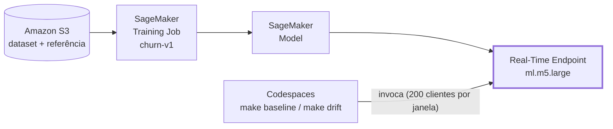
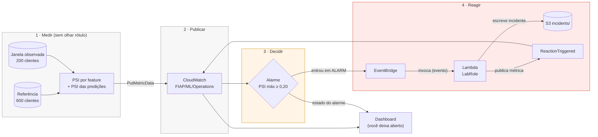

<!--
CONVENÇÃO DE PRINTS DESTE README (nota para o professor, não aparece renderizada)

Cada bloco "> 📸 Print NN" abaixo marca o lugar exato onde a imagem entra, com o que
capturar e o que aquela imagem prova. Depois de salvar o arquivo em `img/`, troque o
bloco pela linha de imagem que está comentada logo abaixo dele.

Este laboratório usa apenas DOIS prints obrigatórios, e os dois são do dashboard:
tudo o mais que o lab afirma já é provado por texto (Saída esperada) ou pelo dossiê
de evidência em artifacts/evidence/. O dashboard é a única evidência que só faz
sentido vista.
-->

# 04.1 - Quando o endpoint está verde e o modelo está errado

> Antes de começar, confira que suas credenciais da AWS estão configuradas:
> [Preparando Credenciais](../../01-create-codespaces/README.md)

Todos os comandos deste laboratório rodam no **terminal do seu Codespaces**, o mesmo
que você usou nos labs 02 e 03. Não crie ambiente novo.

> [!WARNING]
> **Pré-requisitos** — confira os três antes de seguir:
>
> - Codespaces do curso aberto (`terraform version` responde `v1.15.8`)
> - Credenciais do AWS Academy válidas (`aws sts get-caller-identity` responde sem erro)
> - Laboratórios [02](../../02-ml-system/README.md) e [03](../../03-serving-and-scaling/README.md) concluídos — este lab continua a história deles
>
> **Tempo estimado:** ~70 minutos em aula. A execução pura dos comandos dá cerca de 30
> minutos, e mais da metade disso é o `make apply` esperando o treino e o endpoint subirem;
> o resto do tempo é leitura, observação do dashboard e anotação. Escrever o `DECISION.md`
> com o cuidado que ele pede leva outros 15 a 20 minutos, e pode ser feito depois da aula.

Um endpoint pode estar `InService`, responder todas as chamadas com HTTP 200, manter a
latência baixa, e estar errado. Este laboratório existe para você provar isso na AWS
real, com um modelo de verdade, e sair sabendo qual evidência serve para decidir.

## Principais pontos de aprendizagem

- Por que `InService` e HTTP 200 não provam qualidade preditiva
- A diferença entre saúde de **infraestrutura**, de **dados**, de **predições** e de **qualidade**
- O que o PSI mede e, principalmente, o que ele **não** prova
- Por que drift é **sinal**, não sentença
- O que é *delayed ground truth* e por que ele muda a ordem das decisões
- Por que a reação automática segura é abrir incidente, não retreinar
- Como CloudWatch + EventBridge + Lambda formam um laço operacional
- Como transformar observação em evidência e evidência em decisão escrita

## O que você terá ao final

Um endpoint de churn monitorado por um dashboard do CloudWatch em tempo quase real, um
incidente aberto automaticamente por uma Lambda a partir de um alarme de drift, um
dossiê de evidência em que cada afirmação aponta para um arquivo verificável, e uma
decisão sua, escrita, sobre retreinar ou não.

## Arquitetura


O caminho do dado (linhas sólidas) é o mesmo dos labs anteriores e para no endpoint. Tudo o
que este lab acrescenta é o laço tracejado de observabilidade e reação: o PSI publicado no
CloudWatch, o alarme que compara com o limiar, o EventBridge que traduz o alarme em evento e
a Lambda que abre o incidente. O vermelho marca o caminho do incidente, e a ausência de
qualquer seta de volta ao SageMaker é o conteúdo da Parte 5. Fonte editável em
[`diagramas/arquitetura.excalidraw`](diagramas/arquitetura.excalidraw).

Vale ver o mesmo desenho em duas camadas. O caminho principal é o dos labs anteriores: dados
no S3, training job, modelo, endpoint. Nada aqui é novo, e é justamente esse o ponto de
partida — este é o sistema que já estava no ar e funcionando.



O que o Lab 04.1 acrescenta é o laço que observa esse sistema, decide e reage. Repare que
ele não toca em nenhuma das caixas acima:



Repare no que **não** existe nos dois diagramas: nenhuma seta volta da Lambda para o
SageMaker. A reação não retreina, não troca endpoint e não promove modelo. Essa ausência é
o conteúdo da Parte 5.

> [!TIP]
> Os blocos **💡 Clique para entender** são aprofundamento opcional: abra se quiser ver
> a mecânica por baixo do comando. Os blocos **⚠ Se der erro** aparecem logo depois do
> passo que pode causar o problema.

## Mapa do lab

| Parte | O que acontece | Tempo | Passos |
|---|---|---:|---|
| [1](#parte-1) | Ambiente, superfície de comandos e diagnóstico | 5 min | [1](#passo-1) · [2](#passo-2) · [3](#passo-3) · [4](#passo-4) · [5](#passo-5) |
| [2](#parte-2) | Dataset, contrato executável e deploy em dois estágios | 20 min | [6](#passo-6) · [7](#passo-7) · [8](#passo-8) |
| [3](#parte-3) | O dashboard e a linha de base saudável | 8 min | [9](#passo-9) · [10](#passo-10) · [11](#passo-11) · [12](#passo-12) |
| [4](#parte-4) | O mundo muda: drift nos dados e nas predições | 10 min | [13](#passo-13) · [14](#passo-14) |
| [5](#parte-5) | De observação a incidente: alarme, EventBridge, Lambda | 8 min | [15](#passo-15) · [16](#passo-16) · [17](#passo-17) · [18](#passo-18) |
| [6](#parte-6) | A verdade chega atrasada: qualidade, evidência e decisão | 12 min | [19](#passo-19) · [20](#passo-20) · [21](#passo-21) · [22](#passo-22) |
| [7](#parte-7) | Destruir e provar que não sobrou nada | 7 min | [23](#passo-23) · [24](#passo-24) |

Os 20 minutos da Parte 2 são quase todos espera: o `make apply` leva de 10 a 15 minutos
treinando o modelo e subindo o endpoint, e nesse intervalo não há nada para fazer além de
ler. Use o tempo para abrir os blocos `💡` da Parte 2.

Travou em algum passo? Clique no número na tabela acima para pular direto para ele.

## Onde estamos na história?

```text
Lab 02  CONSTRUIR      → modelo + artifact + endpoint
Lab 03  SERVIR/ESCALAR → contratos de inferência + elasticidade
Lab 04  OPERAR         → observabilidade + drift + reação + qualidade
```

A Bora Fibra **não** está começando outro projeto. É o mesmo produto de churn, mais
maduro. O modelo é o mesmo, as features têm os mesmos nomes e o mesmo significado, e a
pergunta que sobrou de cada etapa é o que abre a seguinte:

| Etapa | O que a Bora Fibra conquistou | Pergunta que ficou |
|---|---|---|
| **Lab 02** | Treinou o modelo de churn e transformou o artifact em endpoint consumível | "Agora que funciona, como servir isso de formas diferentes?" |
| **Lab 03** | Comparou contratos de consumo e elasticidade para a mesma capacidade | "Agora que está sendo consumido e pode escalar, como sabemos se continua correto?" |
| **Lab 04.1** | Acrescenta observabilidade, drift, alarme, reação e qualidade atrasada | "Quando observar, quando reagir e quando realmente retreinar?" |

A primeira pergunta para a turma é a que fecha o Lab 03: **se o endpoint escala,
responde e não dá erro, o que ainda pode dar errado?**

## Contexto

> **Algumas semanas depois do Lab 03, segunda-feira, 8h40.** O serviço de churn da Bora
> Fibra já passou da fase de demonstração. Atendimento e campanhas passaram a depender
> dele. O endpoint está `InService`, não há 5XX e a latência segue dentro do esperado.
>
> Helena Marques, diretora de receita, volta com um problema novo: a empresa lançou
> planos, reajustou preços e mudou a política de descontos. A equipe de retenção
> percebeu que os scores começaram a "parecer estranhos", embora nenhum alarme de
> infraestrutura tenha disparado.
>
> "Nós já provamos que o modelo funciona, aprendemos a servi-lo e a escalar. Agora eu
> preciso saber se ele continua enxergando o mesmo mundo em que foi treinado. Se o mundo
> mudou, eu quero detectar cedo e reagir com segurança, sem apertar um botão de
> retraining no escuro."

### Pergunta-âncora

> **Se endpoint, latência e HTTP estão saudáveis, que evidência prova que o sistema de
> ML continua saudável — e quando devemos agir?**

Você vai responder essa pergunta quatro vezes ao longo do lab, e a resposta muda de
qualidade a cada vez:

| Momento | O que passamos a saber | O que ainda não sabemos |
|---|---|---|
| Endpoint `InService` | A infraestrutura funciona | Nada sobre o modelo |
| Linha de base saudável | Temos uma referência observável | Se ela vai se manter |
| Drift detectado | O mundo mudou | Se o modelo errou |
| Ground truth chega | A qualidade caiu ou não | Se retreinar resolve |

### Por que esta arquitetura existe

| Problema de negócio | O que ela responde bem | O que ela responde mal | Quando isso acontece de verdade |
|---|---|---|---|
| "O serviço está no ar?" | Invocações, erro HTTP, latência | Se a resposta está certa | Sempre: é o painel que já existe |
| "O mundo mudou?" | PSI por feature, sem precisar de rótulo | Por que mudou, e se importa | Reajuste de preço, mudança de processo, sazonalidade |
| "O modelo mudou de opinião?" | Distribuição dos scores, taxa prevista | Se a nova opinião está correta | Quando a entrada desloca e o modelo extrapola |
| "A qualidade caiu?" | F1, ROC-AUC, matriz de confusão | Em tempo real (o rótulo demora) | Churn confirmado dias depois do contato |

As quatro linhas medem coisas diferentes e podem discordar entre si. Um sistema de ML
observável é um sistema em que essa discordância **aparece** em vez de ser descoberta
pelo cliente.

> [!CAUTION]
> **Custo.** O vilão deste lab é o **endpoint em tempo real**: uma instância
> `ml.m5.large` cobrada por hora enquanto existir, mesmo sem receber chamada. O training
> job termina sozinho. Dashboard, alarme, métricas customizadas, Lambda, EventBridge e
> S3 custam pouco mas não custam zero.
>
> O `make destroy` é **parte do laboratório**, não opcional. O passo 24 prova por API que
> nada sobrou.

---

<a id="parte-1"></a>

## Parte 1 - O ambiente e a primeira pergunta

### Resultado esperado desta parte

O laboratório responde no seu Codespaces, você conhece os 22 comandos disponíveis e o
`doctor` confirma credencial, região, role e alcance dos seis serviços que o lab usa.

<a id="passo-1"></a>

**1. Reabra o Codespaces do curso**

Use o mesmo Codespaces dos labs anteriores. Se ele estiver parado, o GitHub o retoma com
o conteúdo intacto.

---

<a id="passo-2"></a>

**2. Entre na pasta deste laboratório**

```bash
cd /workspaces/FIAP-Cloud-Based-Machine-Learning/04-ml-operations/01-observability-drift-response
```

---

<a id="passo-3"></a>

**3. Instale o que este laboratório precisa**

```bash
make setup
```

> Saída esperada (leva de 30 a 90 segundos):
> ```text
> ==> terraform : Terraform v1.15.8
> ==> python    : Python 3.x.x
> ==> pronto. Próximo passo: make doctor
> ```

<details>
<summary><b>💡 Clique para entender: o que <code>make setup</code> faz por baixo dos panos</b></summary>
<blockquote>

`scripts/setup.sh` confere se o `terraform` existe (e para com mensagem clara se não
existir, em vez de tentar instalar algo), cria ou reaproveita o `.venv` deste lab e roda
`pip install -r requirements.txt`, que trava boto3, botocore, numpy, scikit-learn, PyYAML
e pytest nas versões exatas testadas. É idempotente: rodar de novo confirma o que já
está no lugar.

Todo o progresso vai para `stderr`, não `stdout`. Isso vale para o lab inteiro e tem uma
razão prática: `make status > status.json` produz um JSON válido, sem narração no meio do
arquivo.

</blockquote>
</details>

---

<a id="passo-4"></a>

**4. Conheça a superfície de comandos do laboratório**

```bash
make help
```

> Saída esperada:
> ```text
> Lab 04.1 - Observabilidade, drift e resposta operacional
>
>   help           Lista os alvos disponíveis
>   setup          Cria/atualiza o .venv do lab com as dependências fixadas
>   doctor         Confere ferramentas, credencial/região/role e alcance dos serviços
>   data           Gera o dataset determinístico e as duas janelas de produção
>   validate-data  Roda o contrato de dados executável e imprime os hashes exatos
>   test           Roda os testes unitários (PSI, contrato de dados, handler da Lambda)
>   fmt            Formata o Terraform (confere no CI, reescreve localmente)
>   validate       terraform init + fmt -check + validate
>   plan           Planeja o estágio atual
>   apply          Provisiona storage + treino, portão, e então endpoint + dashboard + alarme + reação
>   status         Descreve endpoint, alarme, dashboard, Lambda e regra do EventBridge em JSON
>   dashboard      Imprime o nome e o link direto do dashboard do CloudWatch
>   baseline       Observa a janela saudável, publica as métricas e prova que o alarme está OK
>   drift          Observa a janela deslocada, publica o drift e nomeia as variáveis responsáveis
>   alarm-status   Mostra o estado do alarme de drift e as transições recentes
>   reaction       Espera o incidente que a Lambda escreve no S3 e valida o conteúdo
>   ground-truth   Avalia a qualidade com o rótulo que chegou depois e publica F1/ROC-AUC
>   evidence       Consolida o dossiê conferível em artifacts/evidence/
>   destroy        Destrói todos os recursos gerenciados
>   verify-clean   Prova por consulta direta à API que não sobrou nada cobrando
>   e2e            Ciclo completo com limpeza à prova de falha (KEEP_RESOURCES=1 pula o destroy)
>   clean          Remove artefatos locais gerados (nunca toca na AWS)
>
>   Ciclo completo:  make e2e
>   Manter recursos: make e2e KEEP_RESOURCES=1   (você precisa rodar make destroy depois)
> ```

<details>
<summary><b>💡 Clique para entender: o que cada comando faz de verdade</b></summary>
<blockquote>

| Comando | O que executa por baixo | Por que existe / quando usar |
|---|---|---|
| `help` | `grep` + `awk` nos comentários `##` do próprio Makefile | A lista nunca sai de sincronia com os alvos, porque é gerada deles |
| `setup` | `bash scripts/setup.sh` | Primeiro comando do lab; idempotente |
| `doctor` | `lab.py doctor` | Falha cedo em credencial expirada, região errada, `LabRole` ausente **ou versão de Terraform divergente** |
| `data` | `lab.py data` | Gera 4.000 linhas base + duas janelas de produção de 200 |
| `validate-data` | `lab.py validate-data` | 18 verificações de contrato + hashes SHA-256; go/no-go antes de gastar nuvem |
| `test` | `pytest tests` | 39 testes de PSI, contrato e handler da Lambda; roda sem tocar na AWS |
| `fmt` | `terraform fmt -recursive` | Reescreve a formatação localmente |
| `validate` | `terraform init` + `fmt -check` + `validate` | O `init` é onde o `required_version` é avaliado |
| `plan` | `validate-data` + `validate` + `terraform plan` | Ver o que mudaria sem aplicar |
| `apply` | Estágio 1 (`-var deploy_serving=false`) → `wait-training` → estágio 2 | Já encadeia `data` e `validate-data`; você não precisa rodá-los à mão |
| `status` | `DescribeEndpoint`, `DescribeAlarms`, `GetDashboard`, `GetFunctionConfiguration`, `DescribeRule` | Uma foto do que está de pé, em JSON |
| `dashboard` | `lab.py dashboard` | Imprime o link direto; você não precisa achar o nome no console |
| `baseline` | Invoca o endpoint na janela saudável, calcula PSI, publica, confere que o alarme está `OK` | Cria a referência observável da aula |
| `drift` | Idem na janela deslocada, e nomeia as features responsáveis | O momento em que o mundo muda |
| `alarm-status` | `DescribeAlarms` + `DescribeAlarmHistory` | Ver o estado e como ele chegou lá |
| `reaction` | Espera objeto em `s3://.../incidents/`, valida o conteúdo, conta invocações no log | Prova que a reação aconteceu **e** que ela não retreinou |
| `ground-truth` | Junta predições salvas com os rótulos que chegaram depois; publica F1/ROC-AUC | A única etapa que mede acerto |
| `evidence` | Consulta o estado real e escreve `artifacts/evidence/` | Fecha o lab com afirmações rastreáveis |
| `destroy` | `terraform destroy -auto-approve` | Obrigatório: o endpoint cobra por hora |
| `verify-clean` | 10 consultas de API por prefixo | O state do Terraform não é autoridade suficiente |
| `e2e` | Tudo acima em ordem, com `trap` de limpeza no `EXIT` | Usado na validação do lab; em aula seguimos passo a passo |
| `clean` | `rm -rf artifacts build` + limpa `__pycache__` | Nunca toca na AWS |

Dependências implícitas que valem conhecer: `doctor`, `data` e `test` já rodam `setup`;
`validate-data` já roda `data`; `plan` e `apply` já rodam `validate-data` e `validate`.

</blockquote>
</details>

---

<a id="passo-5"></a>

**5. Confirme que o ambiente responde**

```bash
make doctor
```

> Saída esperada:
> ```text
> [PASS] python_version: Python 3.x (o lab pede 3.11 ou mais novo)
> [PASS] terraform_version: instalado 1.15.8, versions.tf exige exatamente 1.15.8
> [PASS] aws_credentials: conta 725328554168 (nenhuma credencial é impressa)
> [PASS] aws_region: sessão em us-east-1, o lab exige us-east-1
> [PASS] lab_role: arn:aws:iam::725328554168:role/LabRole
> [PASS] sagemaker_reachable: ListEndpoints respondeu
> [PASS] cloudwatch_reachable: ListMetrics respondeu
> [PASS] eventbridge_reachable: ListRules respondeu
> [PASS] lambda_reachable: ListFunctions respondeu
> [PASS] s3_reachable: ListBuckets respondeu
> [PASS] logs_reachable: DescribeLogGroups respondeu
>
> [PASS] doctor: 11/11 verificações passaram
> ```

O número da conta e o ARN da role vão ser os da **sua** conta do Academy. As 11 linhas
`[PASS]` e a contagem final precisam bater: se vier `10/11`, pare aqui e resolva o
`[FAIL]` antes de continuar, porque todo passo adiante depende do que falhou.

<details>
<summary><b>⚠ Se der erro: <code>[FAIL] aws_credentials</code></b></summary>
<blockquote>

A credencial do AWS Academy expira em poucas horas. Abra o painel do lab na AWS Academy,
clique em **AWS Details**, copie o bloco de credenciais e substitua o conteúdo de
`~/.aws/credentials`. Rode `make doctor` de novo.

O `doctor` nunca imprime chave, segredo ou token: só o número da conta.

</blockquote>
</details>

<details>
<summary><b>⚠ Se der erro: <code>[FAIL] terraform_version</code></b></summary>
<blockquote>

A mensagem diz as duas versões: a instalada e a que o `terraform/versions.tf` exige. O
ambiente base do Codespaces instala a versão certa; se divergiu, rode o `make setup` do
Lab 02, que instala o Terraform com verificação de checksum:

```bash
cd /workspaces/FIAP-Cloud-Based-Machine-Learning/02-ml-system && make setup
cd /workspaces/FIAP-Cloud-Based-Machine-Learning/04-ml-operations/01-observability-drift-response && make doctor
```

Este check existe por um motivo concreto: o `required_version` do Terraform só é
avaliado no `terraform init`, que neste lab mora dentro do `make validate`. Sem a
verificação aqui, uma divergência de versão só apareceria no passo 8, depois de quatro
comandos verdes.

</blockquote>
</details>

<details>
<summary><b>⚠ Se der erro: qualquer outro <code>[FAIL]</code> do doctor</b></summary>
<blockquote>

Os outros nove checks caem em três grupos, e o grupo diz o que fazer:

| `[FAIL]` em | O que significa | O que fazer |
|---|---|---|
| `aws_region` | Sua sessão está apontando para outra região | Confira se `~/.aws/config` tem `region = us-east-1`, ou exporte `AWS_DEFAULT_REGION=us-east-1` no terminal |
| `lab_role` | A `LabRole` não foi encontrada | Ela é criada pelo próprio Academy. Se não existe, o painel do lab foi aberto em uma conta diferente da que está nas suas credenciais: recopie as credenciais do painel |
| `sagemaker_reachable`, `cloudwatch_reachable`, `eventbridge_reachable`, `lambda_reachable`, `s3_reachable`, `logs_reachable` | Uma chamada de leitura barata falhou naquele serviço | A mensagem traz o erro real da AWS. `ExpiredToken` ou `InvalidClientTokenId` = credencial vencida (recopie do painel). `AccessDenied` = a sessão do Academy expirou o direito ou o lab foi aberto em outra conta |
| `python_version` | O `.venv` não foi criado com Python 3.11 ou mais novo | Rode `make clean && make setup` |

Esses seis checks de alcance existem para separar "o lab está errado" de "a conta não
responde". Se todos os seis falharem de uma vez, o problema é credencial ou rede, não o
laboratório.

</blockquote>
</details>

### Checkpoint

- [x] `make doctor` termina com todos os checks em `[PASS]`.
- [x] Os seis checks de alcance de serviço respondem `ok`.
- [x] Você sabe dizer, olhando o `make help`, em que ordem os alvos são usados.

Nenhum recurso foi criado na AWS até aqui.

---

<a id="parte-2"></a>

## Parte 2 - O dataset, o contrato e o deploy

### Resultado esperado desta parte

Um dataset determinístico com a linhagem do Lab 02 e duas janelas de produção, 18
verificações de contrato passando, e um endpoint `InService` com dashboard, alarme,
EventBridge e Lambda de pé.

<a id="passo-6"></a>

**6. Gere o dataset**

```bash
make data
```

> Saída esperada:
> ```text
> [data] gerando o dataset determinístico
> [data] train: 2800 linhas, prevalência 0.3571
> [data] validation: 600 linhas, prevalência 0.3550
> [data] reference: 600 linhas, prevalência 0.3333
> [data] production_baseline: 200 linhas, prevalência 0.3450
> [data] production_shifted: 200 linhas, prevalência 0.3100
> [data] escrito em .../artifacts/data
> ```

Os números são exatos: o gerador tem semente fixa, então **todo aluno obtém as mesmas
cinco prevalências**. Se a sua saída divergir de qualquer uma delas, pare: o dataset não
é o que este README descreve, e os limiares adiante ficam suspeitos.

<details>
<summary><b>💡 Clique para entender: as três camadas de dados e por que elas existem</b></summary>
<blockquote>

**Base (4.000 linhas)** — é o mundo do Lab 02, recriado aqui com a mesma semente
(`20260817`), o mesmo rótulo (`churn`), o mesmo identificador (`observation_id`) e a mesma
ordem de sete features. Dividida em treino (2.800), validação (600) e **referência** (600).
A referência não é canal de treino: é a régua contra a qual todo PSI é medido.

**`production_baseline` (200 linhas)** — clientes que chegaram ao endpoint depois do
go-live e ainda se parecem com aquele mundo.

**`production_shifted` (200 linhas)** — clientes depois das mudanças comerciais. Cada
diferença corresponde a uma decisão da empresa, não a ruído aleatório:

| Decisão da Bora Fibra | Efeito na feature |
|---|---|
| Reajuste de preços e novos planos | `monthly_charges` sobe (~110 → ~158) |
| Novo processo de cobrança | `payment_delay_days` sobe |
| Atendimento sobrecarregado | `support_calls_90d` sobe (~2 → ~5) |
| Experiência percebida piorou | `usage_score` cai (~65 → ~51) |
| Mix migrou para contrato mensal | `annual_contract` cai (35% → 14%) |
| Empurrão comercial no premium | `premium_plan` sobe (30% → 46%) |

E há uma segunda mudança, que o PSI **não** consegue ver: a relação entre as features e o
churn também mudou. O reajuste e o novo processo de cobrança fizeram todo mundo ligar
para o suporte e atrasar pagamento. As duas variáveis que eram o melhor sinal de saída
**saturaram**. Quando todo cliente liga, ligar deixa de distinguir quem vai sair. Quem
sai agora é quem parou de usar o serviço.

Guarde isso: é a razão pela qual o modelo vai errar, e é invisível para qualquer métrica
que não olhe o rótulo verdadeiro.

📚 Documentação oficial: [Input/output interface for the XGBoost algorithm](https://docs.aws.amazon.com/sagemaker/latest/dg/xgboost.html#InputOutput-XGBoost) — explica por que os canais de treino saem sem cabeçalho e com o rótulo na primeira coluna.

</blockquote>
</details>

---

<a id="passo-7"></a>

**7. Cobre o contrato de dados**

```bash
make validate-data
```

> Saída esperada (18 verificações e os hashes):
> ```text
> [PASS] schema.feature_order: 7 features na ordem herdada do Lab 02
> [PASS] schema.label_and_id: rótulo `churn`, identificador `observation_id`
> [PASS] manifest.lineage: bora-fibra-churn vinda de 02-ml-system
> [PASS] rows.train: 2800 linhas (esperado 2800)
> [PASS] rows.validation: 600 linhas (esperado 600)
> [PASS] rows.reference: 600 linhas (esperado 600)
> [PASS] rows.production_baseline: 200 linhas (esperado 200)
> [PASS] rows.production_shifted: 200 linhas (esperado 200)
> [PASS] rows.min_per_split: treino/validação/referência têm pelo menos 400 linhas
> [PASS] values.no_nan_or_inf: nenhum NaN ou infinito
> [PASS] values.bounds: todas as colunas dentro dos limites do contrato
> [PASS] ids.unique: 1000 identificadores, todos distintos entre as janelas
> [PASS] target.prevalence: prevalência entre 0.3333 e 0.3571 (faixa aceita [0.2, 0.5])
> [PASS] payload.no_target: a janela de produção não traz a coluna `churn`: o rótulo ainda não existe no mundo quando a predição acontece
> [PASS] windows.schema_preserved: as duas janelas de produção preservam identificador + ordem de features
> [PASS] ground_truth.production_baseline: 200 rótulos binários, um para cada linha da janela
> [PASS] ground_truth.production_shifted: 200 rótulos binários, um para cada linha da janela
>
> [validate-data] hashes SHA-256 dos arquivos base:
>   train.csv                      151fde05b5a56d2fdd8793e2f0b381402834ecd8a2726c6bd746a133a0833fea
>   validation.csv                 59010d90f46ba244793f56e6c2162f51ed061bdb8c889176370e1adc429ef63c
>   reference.csv                  c4c1b175d179ff4e2c5aa445eba43bbd2c6d87c4b0319c827e041f82f147d18d
>   production_baseline.csv        8a826712d4148735da8f9804bfc4e8900a46e3ed457f10d9d7a4eb7c1e3ba6cf
>   production_shifted.csv         9a28ca865158e954c7891c740e3dfe6f2c2aa67f717162f8140c4b3dec15aa1f
>   ground_truth_baseline.csv      d660585c9a08bd4821d86eebb3d6a098d5bc64c13140b97b883a8bce363c9c81
>   ground_truth_shifted.csv       7d276b041f9e3d227a1a7890222a4c957fa669439ff0dde1104a301f8a8f6d88
> [PASS] hashes.deterministic: todos os arquivos conferem com o manifesto
>
> [PASS] contrato de dados: 18/18 verificações passaram
> ```

Os sete hashes acima são os valores exatos que você deve ver. Eles são a prova de que o
dataset é byte a byte o mesmo em qualquer máquina. Se um deles divergir, algo mudou no
gerador e o resto do lab deixa de ser comparável com este README.

O check `payload.no_target` merece atenção: ele verifica que a janela de produção **não**
carrega a coluna `churn`. Não é detalhe de arrumação. No mundo real o rótulo daquelas 200
linhas ainda não existe no momento da predição; quem o guardasse no payload estaria
vazando o futuro para dentro da inferência.

---

<a id="passo-8"></a>

**8. Publique o sistema na AWS**

```bash
make apply
```

Este comando tem dois estágios com um portão no meio, e leva de 10 a 15 minutos. O tempo
varia com a infraestrutura da AWS no momento; não é o seu código que está lento.

> Saída esperada (trechos):
> ```text
> == estágio 1/2: storage, dataset e training job ==
> ...
> Apply complete! Resources: 11 added, 0 changed, 0 destroyed.
> == portão: esperar o training job e provar que o artefato existe ==
> [wait] esperando o training job prb-cloud-ml-lab3-train-...
> [wait] training job InProgress/Training; aguardando 15s
> [wait] artefato informado pela API: s3://prb-cloud-ml-lab3-.../output/training/.../model.tar.gz
> [wait] HeadObject confirmou 24115 bytes
> [wait] URI gravada em artifact.auto.tfvars.json para o estágio 2 do apply
> == estágio 2/2: model, endpoint, dashboard, alarme, EventBridge e Lambda ==
> ...
> Apply complete! Resources: 10 added, 0 changed, 0 destroyed.
> ```

As contagens `11 added` e `10 added` são exatas: 11 recursos de storage e treino, 10 de
serving e observabilidade. O tamanho do `model.tar.gz` varia alguns bytes entre execuções
: um arquivo comprimido guarda a hora da compressão no cabeçalho, então nem o tamanho nem
o hash de um artefato de treino servem como valor esperado.

<details>
<summary><b>💡 Clique para entender: por que o apply tem dois estágios e um portão</b></summary>
<blockquote>

O recurso `aws_sagemaker_training_job` do provider AWS 6.60.0 **retorna assim que o job
entra em `InProgress`**, e não espera pelo `Completed`. Um apply verde, portanto, não
significa um modelo treinado. E o recurso exporta apenas `arn`: não existe atributo com a
URI do artefato.

Por isso o `make apply` faz três coisas em sequência:

1. **Estágio 1** — `terraform apply -var deploy_serving=false` cria bucket, sobe o dataset
   e dispara o training job. As sete features viram dois canais CSV sem cabeçalho.
2. **Portão** — `lab.py wait-training` chama `DescribeTrainingJob` em laço até um estado
   terminal, lê `ModelArtifacts.S3ModelArtifacts` (a URI **autoritativa**, nunca montada à
   mão), confirma com `HeadObject` que os bytes existem, e grava o valor em
   `terraform/artifact.auto.tfvars.json`.
3. **Estágio 2** — `terraform apply` com `deploy_serving=true` cria Model,
   EndpointConfig, Endpoint, dashboard, alarme, regra do EventBridge, Lambda e log group.

O recurso `aws_sagemaker_endpoint`, diferente do training job, **espera** pelo `InService`.
Então quando o estágio 2 termina verde, a capacidade está de fato alcançável.

O bucket é criado por `terraform_data` + `local-exec` em vez de `aws_s3_bucket`. Motivo: o
`aws_s3_bucket` lê `GetBucketObjectLockConfiguration` logo depois do `CreateBucket`, e a
SCP do AWS Academy nega essa chamada com deny explícito: o bucket é criado e o apply
falha do mesmo jeito.

📚 Documentação oficial: [DescribeTrainingJob](https://docs.aws.amazon.com/sagemaker/latest/APIReference/API_DescribeTrainingJob.html) — documenta o campo `ModelArtifacts.S3ModelArtifacts` que o portão consome.

</blockquote>
</details>

<details>
<summary><b>⚠ Se der erro: <code>ResourceLimitExceeded</code> no training job</b></summary>
<blockquote>

A conta do Academy limita quantas instâncias de treino podem rodar ao mesmo tempo. Se
outro lab seu ainda tiver um job ativo, espere ele terminar:

```bash
aws sagemaker list-training-jobs --status-equals InProgress --max-results 10
```

Depois rode `make apply` de novo; ele é idempotente e retoma de onde parou.

</blockquote>
</details>

<details>
<summary><b>⚠ Se der erro: <code>AccessDenied</code> em <code>s3:GetBucketObjectLockConfiguration</code></b></summary>
<blockquote>

Este erro só aparece se o bucket tiver sido criado por uma versão antiga deste lab, que
usava `aws_s3_bucket`. Trocar o código não limpa o estado: o objeto órfão continua no
state e o `plan` tenta lê-lo. Remova a entrada do state (nada é apagado na AWS):

```bash
cd /workspaces/FIAP-Cloud-Based-Machine-Learning/04-ml-operations/01-observability-drift-response
terraform -chdir=terraform state list | grep aws_s3_bucket
terraform -chdir=terraform state rm aws_s3_bucket.lab
make apply
```

</blockquote>
</details>

### Checkpoint

- [x] `artifacts/data/` tem os sete arquivos base mais o `dataset_manifest.json`.
- [x] Os sete hashes SHA-256 conferem com os do README.
- [x] `[PASS] contrato de dados: 18/18 verificações passaram`.
- [x] `make apply` fechou os dois estágios e o endpoint está `InService`.

A partir daqui existe recurso cobrando na sua conta: o endpoint `ml.m5.large` fica ligado
até o `make destroy` da Parte 7. Se precisar parar a aula no meio, rode `make destroy`
agora e recomece desta Parte depois.

---

<a id="parte-3"></a>

## Parte 3 - O dashboard e a linha de base

### Resultado esperado desta parte

O dashboard aberto no navegador, o endpoint confirmado `InService`, e a primeira janela
de produção medida, com o alarme provando que está em `OK`.

<a id="passo-9"></a>

**9. Abra o dashboard e deixe-o aberto**

```bash
make dashboard
```

> Saída esperada:
> ```text
>   Dashboard : fiap-mlops-xxxxxxxx
>   Widgets   : 12
>
>   Abra o link abaixo e DEIXE ABERTO durante o lab inteiro. Ele atualiza
>   sozinho conforme novas métricas chegam (granularidade de 60 s).
>
> https://us-east-1.console.aws.amazon.com/cloudwatch/home?region=us-east-1#dashboards/dashboard/fiap-mlops-xxxxxxxx
```

Abra o link em uma aba separada e **deixe-a aberta até o passo 23**. Metade do que este
laboratório ensina acontece nessa tela, não no terminal.

O dashboard tem cinco faixas, de cima para baixo, e cada widget tem no título a pergunta
que ele responde:

| Faixa | Pergunta | O que você vê agora |
|---|---|---|
| 1 · Infraestrutura | O endpoint está atendendo? Deu erro? Está lento? | Quase vazio: ninguém chamou o endpoint ainda |
| 2 · Dados | Os dados ainda parecem os mesmos? Qual variável mudou? | Vazio |
| 3 · Predições | O modelo mudou de opinião? Está prevendo mais churn? | Vazio |
| 4 · Qualidade | A qualidade aguentou? E a ordenação? | Vazio: só existe com ground truth |
| 5 · Reação | A regra virou incidente? O sistema reagiu? | Alarme em `OK` ou `INSUFFICIENT_DATA` |

<details>
<summary><b>💡 Clique para entender: por que "tempo quase real" e não "tempo real"</b></summary>
<blockquote>

A granularidade mínima de uma métrica customizada de resolução padrão no CloudWatch é
**60 segundos**, e o console refaz a consulta em intervalo próprio. Existe também latência
entre o `PutMetricData` e o datapoint ficar consultável.

Somando: da publicação até a mudança aparecer no gráfico passam alguns segundos a poucos
minutos. Isso é tempo quase real: suficiente para operar, longe de instantâneo. Prometer
"tempo real" a uma área de negócio cria a expectativa errada e depois cobra caro.

📚 Documentação oficial: [Publishing custom metrics](https://docs.aws.amazon.com/AmazonCloudWatch/latest/monitoring/publishingMetrics.html) — cobre resolução padrão vs. alta resolução e os limites de cada uma.

</blockquote>
</details>

---

<a id="passo-10"></a>

**10. Confirme o que está de pé**

```bash
make status
```

> Saída esperada (JSON, trechos):
> ```text
> {
>   "endpoint": {
>     "nome": "prb-cloud-ml-lab3-ep-xxxxxxxx",
>     "status": "InService",
>     ...
>   },
>   "model_lineage": "churn-v1",
>   "alarme": {
>     "estado": "OK",
>     "limiar": 0.2,
>     "metrica": "DataDriftPSIMax",
>     ...
>   },
>   "dashboard": { "widgets": 12, ... },
>   "lambda": { "runtime": "python3.12", ... },
>   "eventbridge": { "estado": "ENABLED", "alvos": ["arn:aws:lambda:..."] }
> }
> ```

Guarde o `"status": "InService"`. É a afirmação mais forte que a infraestrutura sabe
fazer, e o lab inteiro existe para mostrar o quanto ela **não** cobre.

---

<a id="passo-11"></a>

**11. Observe a janela saudável**

```bash
make baseline
```

> Saída esperada:
> ```text
> [predicao] pontuando as 600 linhas da referência (régua do PSI de predições)
> [predicao] invocando o endpoint para 200 clientes da janela baseline
>
> [drift] janela baseline: PSI máximo 0.0931 (limiar 0.2)
>   usage_score            PSI= 0.0931  estável (quantil)
>   monthly_charges        PSI= 0.0447  estável (quantil)
>   tenure_months          PSI= 0.0357  estável (quantil)
>   payment_delay_days     PSI= 0.0114  estável (quantil)
>   premium_plan           PSI= 0.0033  estável (categoria)
>   support_calls_90d      PSI= 0.0010  estável (quantil)
>   annual_contract        PSI= 0.0006  estável (categoria)
>
> [drift] PSI das predições: 0.0449
> [drift] churn previsto: 0.2950 | probabilidade média: 0.3142
>
> [metricas] DataDriftPSIMax=0.093142  [EndpointName=prb-cloud-ml-lab3-ep-...]
> [metricas] DataDriftPSIMax=0.093142  [EndpointName=..., Window=baseline]
> ...
> [metricas] 13 datapoints publicados em FIAP/ML/Operations
> [alarme] estado após o baseline: OK
> ```

Vale distinguir duas classes de número nessa saída, porque elas se comportam de formas
diferentes:

- **Os sete valores de PSI são determinísticos.** Eles dependem só do dataset, que tem
  semente fixa. Você deve ver exatamente `0.0931` no `usage_score` e exatamente `0.0006`
  no `annual_contract`. Se divergir, o dataset não é o mesmo.
- **`PSI das predições`, `churn previsto` e `probabilidade média` variam um pouco.** Eles
  dependem do modelo treinado na nuvem, e dois treinos do mesmo dataset não produzem
  árvores idênticas. Espere a mesma ordem de grandeza, não o mesmo dígito.

E o `[alarme] estado após o baseline: OK` não é decoração: sem provar que o alarme está em
`OK` agora, a transição do passo 15 não provaria nada.

<details>
<summary><b>💡 Clique para entender: como o PSI é calculado, e as três decisões que mudam o número</b></summary>
<blockquote>

PSI = soma, sobre os bins, de `(obs − ref) × ln(obs / ref)`, onde `obs` e `ref` são as
proporções da janela observada e da referência em cada bin. Sempre ≥ 0.

**Decisão 1 — os bins vêm só da referência.** Por quantil, calculados nas 600 linhas de
referência, e reaplicados à janela observada. Se fossem recalculados na janela observada,
duas distribuições de mesma forma e centros diferentes cairiam nos mesmos quantis
relativos e o PSI voltaria perto de zero, e o deslocamento sumiria justo no caso que
importa. Consequência: **o PSI não é simétrico** para variável contínua. "Referência" é um
papel privilegiado, e é o mundo em que o modelo foi treinado.

**Decisão 2 — quintis, não decis.** O PSI de uma janela sem drift não é zero: é ruído de
amostragem, da ordem de `(bins−1)/n`. Com 200 linhas e 10 bins esse piso fica em ~0,045 e
picos acima de 0,10 acontecem, ou seja, a janela saudável acusaria drift. Com 5 bins o piso cai
para ~0,02.

**Decisão 3 — variável discreta usa frequência por categoria, não quantil.** Uma coluna 0/1 tem
quantis repetidos; ao colapsar as duplicatas sobraria um único bin e o PSI daria
exatamente zero **para sempre**. O monitoramento ficaria cego à mudança de mix de
`annual_contract`. Repare na palavra entre parênteses na saída: `(quantil)` ou
`(categoria)`: ela diz qual caminho cada feature seguiu.

O `epsilon` (1e-6) substitui proporção zero, senão um bin vazio levaria a `log(0)`.

O que o PSI **não** faz: olhar o rótulo. Nem uma vez. É uma comparação de histogramas, e
é por isso que ele pode ser medido no minuto da predição, anos antes de o rótulo chegar.

</blockquote>
</details>

<details>
<summary><b>⚠ Se der erro: <code>o alarme já está em ALARM depois do baseline</code></b></summary>
<blockquote>

Isso acontece se um `make drift` de uma tentativa anterior já publicou um valor alto nesta
mesma janela de 60 segundos. O alarme observa 1 datapoint, então um valor antigo ainda
dentro da janela o mantém disparado.

Espere dois minutos e rode `make baseline` de novo. O comando é idempotente: ele reusa os
scores da referência em cache e só republica as métricas da janela.

</blockquote>
</details>

---

<a id="passo-12"></a>

**12. Leia o dashboard verde**

Volte à aba do dashboard e recarregue. Se algum gráfico ainda estiver vazio, espere um
minuto e recarregue de novo, até três tentativas: a granularidade da métrica é de 60 s e o
console tem o intervalo de consulta dele. Se depois de três minutos as faixas 1 a 3
continuarem vazias, algo falhou de verdade — rode `make baseline` outra vez e confira se a
linha `[metricas] 13 datapoints publicados` apareceu.

**Micropergunta de BI: o que está verde, e o que isso realmente prova?**

O que você deve ver:

- Faixa 1: `Invocações` com algumas dezenas (~30), `4XX`/`5XX` em zero, latência baixa
- Faixa 2: `PSI máximo` num ponto baixo, **bem abaixo** da linha vermelha do limiar
- Faixa 3: `PSI do score` baixo; taxa prevista e probabilidade média em valores modestos
- Faixa 4: vazia, porque ainda não existe ground truth
- Faixa 5: alarme em `OK`, `ReactionTriggered` em zero

Este é o painel de um sistema saudável. Ele prova que a infraestrutura funciona e que a
entrada se parece com o treino. Ele **não** prova que as predições estão certas: nada
nesta tela olhou um rótulo verdadeiro. A faixa 4 está vazia por honestidade, não por
falta de implementação.

> 📸 Print 01 — capture o dashboard inteiro com a linha de base saudável: PSI abaixo do limiar, alarme em `OK`, faixa 4 vazia. É o "antes" da comparação que o passo 16 vai fechar.
<!--  -->

### Checkpoint

- [x] O dashboard existe com 12 widgets e você deixou a aba aberta.
- [x] `make baseline` publicou as métricas da janela saudável.
- [x] PSI máximo **abaixo** de 0,20 e alarme em `OK`.
- [x] A faixa 4 está vazia, e você sabe dizer por quê.

Você tem o "antes" da comparação. Nada nesta tela olhou um rótulo verdadeiro.

---

<a id="parte-4"></a>

## Parte 4 - O mundo muda

### Resultado esperado desta parte

A janela deslocada medida, o PSI cruzando o limiar em cinco features, e o dashboard
mostrando que as predições mudaram de patamar, tudo isso sem que a infraestrutura
tenha piscado.

<a id="passo-13"></a>

**13. Observe a janela depois das mudanças comerciais**

```bash
make drift
```

> Saída esperada:
> ```text
> [predicao] reusando 600 scores da referência em cache
> [predicao] invocando o endpoint para 200 clientes da janela drift
>
> [drift] janela drift: PSI máximo 2.8671 (limiar 0.2)
>   support_calls_90d      PSI= 2.8671  mudança relevante (quantil)  <-- acima do limiar
>   monthly_charges        PSI= 1.5968  mudança relevante (quantil)  <-- acima do limiar
>   usage_score            PSI= 0.6446  mudança relevante (quantil)  <-- acima do limiar
>   payment_delay_days     PSI= 0.4583  mudança relevante (quantil)  <-- acima do limiar
>   annual_contract        PSI= 0.4508  mudança relevante (categoria)  <-- acima do limiar
>   premium_plan           PSI= 0.0920  estável (categoria)
>   tenure_months          PSI= 0.0129  estável (quantil)
>
> [drift] PSI das predições: 2.3035
> [drift] churn previsto: 0.8950 | probabilidade média: 0.8286
>
> [drift] variáveis responsáveis, da maior para a menor:
>   support_calls_90d      PSI=2.8671  mudança relevante
>   monthly_charges        PSI=1.5968  mudança relevante
>   usage_score            PSI=0.6446  mudança relevante
>   payment_delay_days     PSI=0.4583  mudança relevante
>   annual_contract        PSI=0.4508  mudança relevante
>
> [drift] o PSI mede distribuição, não acerto. A queda de qualidade só será
> [drift] conhecida no `make ground-truth`, quando o rótulo verdadeiro chegar.
> ```

Cinco das sete features cruzaram o limiar; duas não. Os sete valores de PSI são
determinísticos, então são exatamente os que você deve ver. O `PSI das predições` e o
`churn previsto` dependem do modelo treinado e variam um pouco, mas a leitura não muda:
**o modelo passou a prever churn para quase 90% da janela.**

Repare em duas coisas que não são acidente. `tenure_months` ficou em `0.0129`: a base de
clientes está apenas envelhecendo normalmente, e **nem tudo desloca ao mesmo tempo**: se
tudo acusasse drift, você não aprenderia a olhar qual variável mudou. E `premium_plan`
mudou de verdade (30% → 46%) mas ficou em `0.0920`, abaixo do limiar: mudança real que o
alarme não vai reportar, porque nem toda mudança merece um incidente.

---

<a id="passo-14"></a>

**14. Leia o dashboard de novo**

Volte à aba do dashboard.

**Micropergunta de BI: qual indicador mudou, e qual não mudou nada?**

O que mudou:

- Faixa 1 (infraestrutura): **nada**. Ainda zero erro, latência igual. Este é o ponto do laboratório inteiro.
- Faixa 2: o `PSI máximo` saltou para muito acima da linha vermelha, e o widget por feature nomeia as responsáveis
- Faixa 3: `PSI do score` disparou, e a **taxa de churn prevista** subiu muito
- Faixa 4: continua vazia

As faixas 2 e 3 mudaram no mesmo instante, porque o mesmo `make drift` publicou as duas.
A ordem que interessa é outra, e é a do laboratório inteiro: **dados e predições respondem
hoje; qualidade só responde no passo 19**, quando o rótulo chegar. É essa defasagem que
obriga alguém a decidir com informação incompleta.

A faixa 3 é a mais interessante para a área de negócio. O modelo passou a prever churn
para a **grande maioria** dos clientes da janela. Ele vê preço alto, chamados de suporte
frequentes e atraso de pagamento (os sinais que ele aprendeu a associar a saída) e conclui
que quase todos vão sair.

Se a Helena olhasse só esta tela, teria duas leituras possíveis: "a empresa está perdendo
a base" ou "o modelo enlouqueceu". A tela não decide entre as duas. Para isso falta o
rótulo verdadeiro, e ele chega na Parte 6.

### Checkpoint

- [x] `make drift` publicou PSI máximo **acima** de 0,20.
- [x] Você sabe nomear a feature responsável pelo maior PSI.
- [x] O PSI das predições também subiu, junto com a taxa de churn prevista.
- [x] Você sabe explicar por que nada disso ainda prova que o modelo está errado.

O endpoint continua `InService` e sem erro de HTTP. É esse o incômodo da Parte 4.

---

<a id="parte-5"></a>

## Parte 5 - De observação a incidente

### Resultado esperado desta parte

O alarme em `ALARM`, um incidente em JSON escrito no S3 por uma Lambda que o EventBridge
invocou, e a prova de que essa reação **não** retreinou nada.

<a id="passo-15"></a>

**15. Consulte o alarme**

```bash
make alarm-status
```

> Saída esperada:
> ```text
> [alarme] ALARM: Threshold Crossed: 1 out of the last 1 datapoints [2.867064322267683 (12/09/26 18:28:00)] was greater than or equal to the threshold (0.2) (minimum 1 datapoint for OK -> ALARM transition).
>
> [alarme] transições recentes:
>   2026-09-12 15:29:20.245000-03:00  Alarm updated from OK to ALARM
>   2026-09-12 15:25:20.246000-03:00  Alarm updated from INSUFFICIENT_DATA to OK
> ```

O texto do `Threshold Crossed` vem da própria AWS, em inglês: é o campo `StateReason` do
`DescribeAlarms`, e o lab o mostra como veio em vez de traduzir, porque é essa a string que
você vai encontrar no console e em qualquer busca. A sua data será outra; o valor
`2.867...` é o mesmo, porque é o PSI determinístico que o passo 13 publicou.

As duas transições contam a história inteira do alarme, e a primeira surpreende: ele
nasceu em `INSUFFICIENT_DATA` e foi para `OK` **sozinho, cerca de um minuto depois de ser
criado** — antes de qualquer métrica existir. Quem o levou para `OK` foi o
`treat_missing_data = notBreaching`, que manda tratar ausência de dado como não-violação.
Foi por isso que o passo 10 já mostrava `OK`. O baseline não mudou o estado do alarme; ele
provou que o estado continuava `OK` com dado real medido.

Se ainda vier `OK`, o CloudWatch não terminou de avaliar o datapoint. Espere um minuto e
rode de novo, ou use a versão que espera pela transição, com teto de tempo:

```bash
.venv/bin/python scripts/lab.py alarm-status --wait-for-alarm
```

<details>
<summary><b>💡 Clique para entender: as quatro escolhas por trás deste alarme</b></summary>
<blockquote>

**Dimensão só `EndpointName`.** O `lab.py` publica `DataDriftPSIMax` duas vezes: uma com
`[EndpointName]` e outra com `[EndpointName, Window]`. No CloudWatch, mudar o conjunto de
dimensões cria uma **métrica diferente**, não um filtro da mesma série. O alarme observa a
versão sem `Window`; se apontasse para a série com `Window=baseline`, nunca veria o
drift. O dashboard usa a versão com `Window` para separar as duas janelas no gráfico.

**1 datapoint, período de 60 s.** Uma aula não pode esperar uma janela estatística longa.
O preço é sensibilidade a um ponto único; aceitável aqui porque cada janela publica
exatamente um valor.

**`treat_missing_data = notBreaching`.** Antes do primeiro `make baseline` não existe
datapoint. Sem isso o alarme abriria em `INSUFFICIENT_DATA`, e você não distinguiria
"ainda não mediu" de "mediu e está ruim".

**Nenhuma ação de alarme.** O alarme não chama a Lambda diretamente. Quem faz a ponte é o
EventBridge, ouvindo a mudança de estado: acoplamento mais frouxo, e é o padrão que a AWS
documenta para reagir a alarme com lógica própria.

📚 Documentação oficial: [CloudWatch and EventBridge](https://docs.aws.amazon.com/AmazonCloudWatch/latest/monitoring/cloudwatch-and-eventbridge.html) — mostra o formato do evento `CloudWatch Alarm State Change` que a Lambda recebe.

</blockquote>
</details>

---

<a id="passo-16"></a>

**16. Veja o alarme no dashboard**

Volte à aba do dashboard.

**Micropergunta de BI: qual regra transformou observação em incidente?**

A faixa 5 mudou: o widget de alarme está vermelho, em `ALARM`. Compare com a faixa 2: o
ponto de PSI está muito acima da linha vermelha do limiar.

A resposta à micropergunta é uma frase só: **PSI máximo ≥ 0,20, avaliado em um datapoint
de 60 segundos.** Não foi "o sistema percebeu". Foi uma comparação numérica que alguém
escolheu, com um limiar que alguém definiu, e que está escrito em
`terraform/monitoring.tf`. Toda detecção de drift em produção é uma decisão de projeto
disfarçada de fato técnico.

> 📸 Print 02 — capture o dashboard com o alarme em `ALARM` e o PSI acima do limiar, mostrando a faixa 1 ainda verde ao lado. Esta é a imagem que resume o laboratório: infraestrutura saudável, sistema de ML degradado.
<!--  -->

---

<a id="passo-17"></a>

**17. Confirme a reação automática**

```bash
make reaction
```

> Saída esperada:
> ```text
> [reacao] esperando o incidente em s3://prb-cloud-ml-lab3-.../incidents/ (teto 300s)
> [reacao] incidente encontrado: s3://prb-cloud-ml-lab3-.../incidents/2026...-....json
>
> [reacao] decisão registrada : INVESTIGATE
> [reacao] ação recomendada   : HOLD_PROMOTION_AND_VALIDATE_GROUND_TRUTH
> [reacao] invocações no log  : 1
> [reacao] training jobs novos: 0 (esperado 0 — a reação não retreina)
> ```

A última linha é a mais importante do laboratório. O sistema reagiu, e a reação
**não** foi retreinar.

<details>
<summary><b>💡 Clique para entender: por que a reação segura não é retreinar</b></summary>
<blockquote>

Retreinar automaticamente porque o PSI subiu é institucionalizar erro, por dois motivos
independentes:

**O drift pode não ter afetado o modelo.** PSI mede distribuição de entrada, não acerto.
Se o mundo mudou e o modelo continua correto, o retraining automático joga fora um modelo
bom e substitui por outro sem evidência de que seja melhor.

**O rótulo ainda não chegou.** No churn da Bora Fibra o rótulo verdadeiro demora dias.
Retreinar agora significa treinar contra um período cujo desfecho ninguém conhece, e
qualquer erro entra no modelo novo como se fosse verdade.

Então a Lambda faz três coisas e para: valida o evento, escreve um JSON de incidente no
S3, publica `ReactionTriggered=1`. O incidente declara explicitamente o que **não** foi
automatizado: criar training job, trocar endpoint, promover modelo, publicar `churn-v2`.

Este lab opera `churn-v1` e nunca treina `churn-v2`. Se existe evidência para começar um
processo de retraining é **você** quem decide, no passo 22.

A Lambda valida o evento por conta própria mesmo tendo o filtro do EventBridge na frente:
uma função que confia no filtro de quem a chama quebra quando alguém a reaproveita em
outra regra, ou quando um teste manual manda um payload à mão.

</blockquote>
</details>

<details>
<summary><b>⚠ Se der erro: <code>nenhum incidente apareceu</code></b></summary>
<blockquote>

O caminho tem três elos: alarme → EventBridge → Lambda. Veja o log da função para
descobrir qual falhou:

```bash
aws logs tail /aws/lambda/$(terraform -chdir=terraform output -raw lambda_function_name) --since 15m --format short
```

Se o log estiver vazio, a Lambda não foi invocada; confira a regra e o alvo com
`make status`. Se o log tiver `Traceback`, a função foi invocada e falhou; a mensagem diz
onde.

</blockquote>
</details>

---

<a id="passo-18"></a>

**18. Veja a reação no dashboard**

Volte à aba do dashboard.

**Micropergunta de BI: o sistema reagiu, e o que exatamente ele fez?**

Na faixa 5, `ReactionTriggered` saiu de zero.

O laço está fechado: alguém mediu, alguém publicou, uma regra comparou, um evento nasceu,
uma função reagiu, e a reação apareceu no mesmo painel. Nenhuma pessoa foi acordada, e
nenhum modelo foi trocado.

Vale abrir o incidente e ler o que ele diz:

```bash
aws s3 cp s3://$(terraform -chdir=terraform output -raw bucket_name)/incidents/ . --recursive --exclude '*' --include '*.json' && cat *.json | head -40
```

### Checkpoint

- [x] O alarme de drift chegou a `ALARM`, com o motivo registrado pelo CloudWatch.
- [x] A Lambda foi invocada pelo EventBridge (aparece no log).
- [x] Existe um JSON de incidente em `incidents/` no S3, e você leu o conteúdo.
- [x] **Nenhum** training job novo foi criado depois do alarme.

O último item é o mais importante da Parte 5: o sistema reagiu abrindo um incidente, não
retreinando. Essa ausência foi projetada.

---

<a id="parte-6"></a>

## Parte 6 - A verdade chega atrasada

### Resultado esperado desta parte

F1 e ROC-AUC das duas janelas no dashboard, a queda medida, o dossiê de evidência escrito
e a sua decisão registrada em `DECISION.md`.

<a id="passo-19"></a>

**19. Meça a qualidade com o rótulo que chegou depois**

```bash
make ground-truth
```

> Saída esperada:
> ```text
> [ground-truth] os rótulos verdadeiros chegaram: juntando com as predições salvas
>
> [ground-truth] janela baseline (200 clientes)
>   F1            : 0.7812
>   ROC-AUC       : 0.9265
>   precisão      : 0.8475
>   recall        : 0.7246
>   churn previsto: 0.2950  |  real: 0.3450
>   matriz        : VN=122 FP=9 FN=19 VP=50
>   modo de falha : prevê churn de menos: o número de falsos negativos domina. Cliente que ia sair passaria sem ser abordado.
>
> [ground-truth] janela drift (200 clientes)
>   F1            : 0.5145
>   ROC-AUC       : 0.7726
>   precisão      : 0.3464
>   recall        : 1.0000
>   churn previsto: 0.8950  |  real: 0.3100
>   matriz        : VN=21 FP=117 FN=0 VP=62
>   modo de falha : prevê churn demais: o número de falsos positivos domina. Campanha de retenção seria disparada para cliente que ia ficar.
>
> [ground-truth] queda de F1: 0.2667
> [ground-truth] o drift de dados veio acompanhado de perda de qualidade medida
> ```

F1 e ROC-AUC **variam um pouco entre execuções**: eles dependem do modelo treinado na
nuvem. Precisão, recall e os quatro números da matriz de confusão variam pela mesma razão
— eles saem das mesmas predições. Os `churn real` (0.3450 e 0.3100) são determinísticos,
porque vêm do dataset.

Então não compare dígito a dígito: compare o **padrão**. O que precisa aparecer na sua
execução é falso positivo dominando na janela com drift e falso negativo dominando na
janela baseline. Se o seu `FP` da janela drift vier 95 ou 130 em vez de 117, está tudo
certo; se vier menor que o `FN`, aí sim algo saiu do lugar.

A leitura está na matriz de confusão. Compare as duas linhas:

| | baseline | drift |
|---|---|---|
| Falso positivo | 9 | **117** |
| Falso negativo | 19 | 0 |
| Recall | 0,72 | 1,00 |
| Precisão | 0,85 | 0,35 |

O modelo degradado passou a acertar **todos** os clientes que iam sair (recall 1,00), o que
num relatório mal lido pareceria uma melhoria. O preço está na coluna ao lado: 117
clientes que iam ficar seriam marcados como churn. Na prática, a Bora Fibra disparia
campanha de retenção com desconto para mais da metade da base sem necessidade.

E repare que o modo de falha **inverteu de sinal**. Na janela saudável o modelo errava por
cautela (deixava 19 passarem); na janela deslocada ele erra por pânico. Um F1 mais baixo
não te diz qual dos dois está acontecendo; a matriz diz, e é por isso que ela está no
relatório.

<details>
<summary><b>💡 Clique para entender: por que o rótulo chega depois, e o que isso custa</b></summary>
<blockquote>

Para saber se um cliente **de fato** cancelou, é preciso esperar: o ciclo de faturamento
fechar, o pedido de cancelamento entrar, o prazo de retratação passar. Dias, às vezes
semanas. Nesse intervalo, o modelo continua decidindo, e campanhas continuam sendo
disparadas com base nessas decisões.

Esse é o *delayed ground truth*, e ele reordena as prioridades de MLOps. Drift é o único
sinal disponível **no dia**. Qualidade é o único sinal que prova erro, e ele chega
**depois**. Um sistema que só reage a queda de F1 reage semanas atrasado; um sistema que
reage só a drift reage no escuro.

Por isso a resposta certa a drift é abrir incidente e esperar a evidência, que é
exatamente o que a Lambda fez.

Aqui a espera é simulada: os rótulos já existem em `artifacts/data/ground_truth_*.csv`,
gerados junto com as janelas, e o `make ground-truth` os junta às predições que ficaram
salvas em `artifacts/predictions/` desde os passos 11 e 13. Em produção esse arquivo
seria uma consulta ao sistema de faturamento, e a junção seria por chave de cliente do
mesmo jeito.

📚 Documentação oficial: [Model quality monitoring](https://docs.aws.amazon.com/sagemaker/latest/dg/model-monitor-model-quality.html) — descreve o mecanismo gerenciado equivalente; este lab implementa a lógica à mão de propósito, para o mecanismo ficar visível.

</blockquote>
</details>

---

<a id="passo-20"></a>

**20. Veja a qualidade no dashboard**

Volte à aba do dashboard, faixa 4, que estava vazia desde o passo 9.

**Micropergunta de BI: a mudança de distribuição virou perda de qualidade?**

Agora `F1 · baseline` e `F1 · drift` aparecem lado a lado, e o mesmo para ROC-AUC. Este é
o único momento do laboratório em que a resposta é sim ou não com evidência.

E a resposta aqui é **sim**, mas guarde que ela poderia ter sido não. Se a Bora Fibra
tivesse reajustado preços sem que isso mudasse quem cancela, a faixa 2 estaria vermelha e
a faixa 4 estaria intacta. Nesse cenário, retreinar teria sido o erro.

É por isso que o mesmo painel tem as quatro faixas: elas medem coisas diferentes e o
trabalho de quem opera é ler as quatro juntas.

---

<a id="passo-21"></a>

**21. Gere o dossiê de evidência**

```bash
make evidence
```

> Saída esperada:
> ```text
> [evidence] consultando o estado real dos recursos
> [evidence] contando datapoints no CloudWatch
>
> [evidence] dossiê escrito em .../artifacts/evidence
>   alarm.json
>   baseline-drift.json
>   cloudwatch.json
>   dashboard.json
>   evidence.md
>   manifest.json
>   production-drift.json
>   quality.json
>   quality.md
>   reaction.json
>   resource-status.json
> ```

Abra o `artifacts/evidence/evidence.md`. Ele tem oito seções, e cada linha de cada tabela
cita o arquivo e o campo de onde o número saiu. A seção 8 lista o que o dossiê **não**
prova, inclusive que ninguém demonstrou aqui que retreinar resolveria.

---

<a id="passo-22"></a>

**22. Escreva a sua decisão**

Abra o `DECISION.md` deste laboratório e preencha as dez seções. Ele está em branco de
propósito: as perguntas-guia estão lá, as respostas são suas.

Escreva como se a Helena fosse ler — porque, na prática, é ela quem lê. O exercício não é
descrever o que aconteceu; é defender uma recomendação com a evidência que você tem, e
declarar o que você **não** faria ainda.

<details>
<summary><b>💡 Clique para entender: o que é um gatilho bem formado (exemplo de outro domínio)</b></summary>
<blockquote>

Duas seções do `DECISION.md` pedem uma **condição**, não uma opinião: "condição para
retraining" e "condição para rollback". A diferença entre as duas formas:

Fraco, porque ninguém consegue executar sem te perguntar o que você quis dizer:

> Retreinar quando o modelo piorar de forma consistente.

Bem formado, porque diz o número, a janela, o volume mínimo e quem decide:

> **Exemplo de outro domínio (previsão de atraso de entrega):** iniciar o processo de
> retraining quando o F1 semanal, medido sobre pelo menos 500 entregas com desfecho
> confirmado, ficar abaixo de 0,70 por duas semanas consecutivas, sendo 0,82 a referência
> da última promoção. A decisão de promover o modelo novo é do time de dados junto com a
> operação logística; manter o antigo no ar durante a validação é automático.

Repare no que o exemplo tem: uma métrica, um limiar, um tamanho mínimo de amostra, uma
duração ("duas semanas consecutivas", que evita reagir a uma semana ruim), uma referência
de comparação, e um responsável. Um gatilho sem duração dispara com ruído; um sem tamanho
mínimo de amostra dispara com dez casos; um sem responsável não é executado por ninguém.

O exemplo é de logística de propósito: ele mostra a **forma**, não a resposta do churn da
Bora Fibra. Os números do seu gatilho têm que sair da evidência que você mediu nos passos
19 e 21.

</blockquote>
</details>

### Checkpoint

- [x] `make ground-truth` mostrou a queda de F1 e de ROC-AUC entre as duas janelas.
- [x] Você sabe nomear o modo de falha (o modelo prevê churn demais).
- [x] `make evidence` gerou o dossiê em `artifacts/evidence/`, com as oito seções.
- [x] Você preencheu as dez seções do `DECISION.md`, incluindo as duas condições.

Agora o drift deixou de ser sinal e passou a ser perda medida. A decisão é sua, e está
escrita.

---

<a id="parte-7"></a>

## Parte 7 - Destruir e provar

### Resultado esperado desta parte

Nenhum recurso cobrando, provado por consulta direta à API — não pelo state do Terraform.

> [!IMPORTANT]
> O endpoint cobra por hora enquanto existir. Não pule esta parte, e não a deixe para
> depois do intervalo.

<a id="passo-23"></a>

**23. Destrua tudo**

```bash
make destroy
```

> Saída esperada (última linha):
> ```text
> Destroy complete! Resources: 21 destroyed.
> ```

O `terraform destroy` remove endpoint, config, model, dashboard, alarme, regra, Lambda,
log group e bucket. O bucket sai com `aws s3 rb --force`, que esvazia antes de apagar — o
`model.tar.gz` e os JSON de incidente foram escritos pelo SageMaker e pela Lambda, não
por nenhum `aws_s3_object`, e um `DeleteBucket` simples falharia em bucket não vazio.

---

<a id="passo-24"></a>

**24. Prove que não sobrou nada**

```bash
make verify-clean
```

> Saída esperada:
> ```text
> [PASS] no_endpoint: nenhum endpoint com o prefixo do lab
> [PASS] no_endpoint_config: nenhum endpoint config
> [PASS] no_model: nenhum model
> [PASS] no_training_job_running: nenhum training job em execução
> [PASS] no_alarm: nenhum alarme
> [PASS] no_dashboard: nenhum dashboard fiap-mlops-*
> [PASS] no_event_rule: nenhuma regra do EventBridge
> [PASS] no_lambda: nenhuma função Lambda
> [PASS] no_log_group: nenhum log group da Lambda
> [PASS] no_bucket: nenhum bucket do lab
>
> [PASS] verificação de limpeza: 10/10 verificações passaram
> ```

As dez linhas precisam vir `[PASS]`. Este comando não olha o state do Terraform: ele
pergunta a cada serviço se o recurso ainda existe, reconstruindo o prefixo a partir do
`config/lab.yaml`. Um `destroy` que falhou no meio, um state apagado ou um recurso criado
fora do Terraform apareceriam aqui.

O `no_dashboard` é o check que um `verify-clean` ingênuo esquece: dashboard não aparece em
nenhuma listagem de compute e continua existindo depois de o endpoint morrer.

<details>
<summary><b>⚠ Se der erro: qualquer <code>[FAIL]</code> com <code>AINDA COBRANDO</code></b></summary>
<blockquote>

Rode `make destroy` de novo — ele é idempotente. Se o mesmo recurso insistir, apague pelo
nome que o próprio `[FAIL]` imprimiu:

```bash
aws sagemaker delete-endpoint --endpoint-name <nome-que-apareceu>
```

Depois rode `make verify-clean` mais uma vez. Não encerre o laboratório com um `[FAIL]`
de endpoint: ele é o recurso que cobra por hora.

</blockquote>
</details>

### Checkpoint

- [x] `make destroy` terminou sem erro.
- [x] `make verify-clean` fecha com os 10 checks em `[PASS]`.
- [x] Em especial, `no_endpoint` e `no_dashboard` passaram.

A conta está limpa e você tem a prova por consulta direta à API, não pela palavra do state
do Terraform. É assim que se encerra um laboratório.

---

## Conclusão

Você provou na AWS real que um endpoint pode estar `InService`, responder todas as
chamadas com HTTP 200, manter a latência baixa — e estar prevendo churn para quase toda a
base por causa de uma mudança de preço que aconteceu semanas antes.

Os quatro níveis de saúde discordaram entre si, na ordem em que discordam na vida real:

1. **Infraestrutura** ficou verde de ponta a ponta e nunca soube de nada
2. **Dados** avisaram primeiro, sem precisar de rótulo, e nomearam as variáveis
3. **Predições** mudaram de patamar de forma visível para a área de negócio
4. **Qualidade** confirmou a perda — dias depois, na vida real

E o sistema reagiu sem fazer a coisa mais tentadora. Não houve retraining automático,
porque drift é sinal e não sentença: se a distribuição muda mas o modelo continua certo,
retreinar joga fora um modelo bom; se o rótulo ainda não chegou, retreinar institucionaliza
um erro que ninguém conferiu.

A pergunta-âncora tem resposta: a evidência que prova que o sistema de ML continua
saudável não está no painel de infraestrutura, e chega em duas partes — uma no dia (drift)
e uma depois (qualidade). Agir cedo com a primeira e decidir com a segunda é o que separa
operar um sistema de ML de hospedar um modelo.

## Próximo passo

**04.2 — SLM no SageMaker** (laboratório futuro): deploy de um *small language model* no
SageMaker, com as mesmas perguntas de operação aplicadas a um tipo de modelo em que
"resposta certa" é bem mais difícil de definir.

<details>
<summary><b>💡 Glossário rápido</b></summary>
<blockquote>

| Termo | O que é neste laboratório |
|---|---|
| **PSI** | *Population Stability Index*. Compara dois histogramas da mesma variável. Não olha rótulo |
| **Data drift** | A distribuição das features de entrada mudou em relação ao treino |
| **Concept drift** | A relação entre as features e o rótulo mudou. Invisível ao PSI |
| **Prediction drift** | A distribuição dos scores do modelo mudou |
| **Ground truth** | O rótulo verdadeiro. Aqui chega depois da predição, como na vida real |
| **Delayed ground truth** | O intervalo entre prever e saber se acertou |
| **F1** | Média harmônica de precisão e recall. Sensível a falso positivo e falso negativo |
| **ROC-AUC** | Qualidade da *ordenação* dos scores, independente do limiar de decisão |
| **Falso positivo** | Cliente previsto como churn que ia ficar. Custa campanha e desconto |
| **Falso negativo** | Cliente previsto como não-churn que saiu. Custa o cliente |
| **Limiar de decisão** | O corte (0,5 aqui) que transforma probabilidade em sim/não |
| **Alarme** | Regra do CloudWatch que compara métrica com limiar e muda de estado |
| **`treat_missing_data`** | O que o alarme faz quando não há datapoint. Aqui: não considerar violação |
| **EventBridge** | Barramento de eventos. Ouve a mudança de estado do alarme e invoca a Lambda |
| **`LabRole`** | Role pré-provisionada do Academy. O lab não pode criar role de IAM |
| **`churn-v1`** | Nome didático da versão em operação. Este lab nunca treina `churn-v2` |
| **Namespace** | Agrupamento de métricas no CloudWatch. Aqui: `FIAP/ML/Operations` |
| **Dimensão** | Par chave/valor que identifica uma série. Mudar dimensão cria outra métrica |

</blockquote>
</details>

<details>
<summary><b>💡 Como pedir ajuda se travou</b></summary>
<blockquote>

Junte estas quatro informações antes de pedir ajuda — com elas, quase todo problema se
resolve na primeira resposta:

1. **Em qual passo numerado** você travou (de 1 a 24)
2. **O erro literal**, copiado inteiro do terminal (nunca uma descrição do erro)
3. **A saída do `make doctor`** — ela responde credencial, região, role e versão de uma vez
4. **O que você já tentou**

Onde pedir, nesta ordem:

1. Durante a aula: levante a mão. O erro provavelmente é o de mais alguém
2. Canal da turma no Teams: cole as quatro informações acima
3. Se o problema for da AWS e não do lab (`ResourceLimitExceeded`, quota, credencial que expira em minutos), diga isso explicitamente — o encaminhamento é outro

Se sobrou recurso de pé e você precisa sair, rode `make destroy` **antes** de pedir ajuda.
O endpoint cobra por hora, e ninguém consegue depurar mais rápido que o relógio.

</blockquote>
</details>
