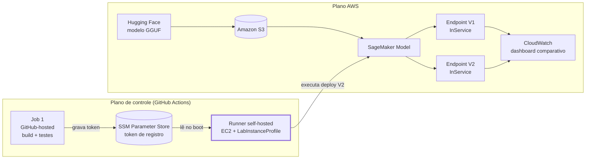

# 04.2 - Do score à ação: SLM, releases e CI/CD sem chaves AWS

> Antes de começar, confira que suas credenciais AWS Academy estão ativas e que o Codespaces deste repositório está aberto. Veja [Preparando Credenciais](../../01-create-codespaces/README.md) se ainda não configurou.

Todos os comandos deste laboratório rodam no **terminal do seu Codespaces**. É o mesmo ambiente dos Labs 02, 03 e 04.1 — nenhuma ferramenta nova para instalar, nenhum ambiente novo para abrir.

> [!WARNING]
> Antes de começar, confirme:
> - Codespaces aberto e íntegro: `terraform version`
> - Credenciais AWS Academy válidas: `aws sts get-caller-identity`
> - Labs 02, 03 e 04.1 concluídos (a infraestrutura de dados e o endpoint deste lab dependem deles)
> - Sua conta GitHub tem permissão de admin ou maintain neste repositório (necessária para registrar o runner self-hosted em Settings → Actions → Runners)
> - Budget do AWS Academy com margem para EC2 (runner) + 2 endpoints SageMaker (V1 e V2) rodando simultaneamente
>
> Tempo total estimado: **~100 min** (9 partes, ver Mapa do lab).

Um endpoint que decide certo não resolve o problema se a ação que vem depois dele for inconsistente. Nos labs anteriores você serviu e operou um endpoint de churn. Este lab entra na etapa seguinte: transformar aquele score em uma ação de negócio — redigida por um SLM local — e fazer isso com **duas releases controladas** do mesmo artefato, entregues por um pipeline de CI/CD que nunca guarda uma chave AWS.

## Principais pontos de aprendizagem

- Por que um SLM em formato GGUF, quantizado, roda em CPU sem custo de GPU
- Diferença entre lançar uma **release** de um artefato já treinado e retreinar um modelo
- Por que um runner self-hosted é necessário aqui e por que OIDC não resolve no AWS Academy
- Os riscos de expor um runner self-hosted em repositório público, e como este lab os mitiga
- O padrão candidate-before-promotion: validar antes de assumir tráfego
- Como avaliar saída generativa sem comparar texto exato
- Onde termina a responsabilidade do SLM: ele não decide churn, só redige a ação depois do score

## O que você terá ao final

Dois endpoints SageMaker `InService` — V1 publicado manualmente e V2 publicado pelo pipeline de CI/CD, com autoscaling configurado. Um dashboard CloudWatch comparando os dois lado a lado, evidência rastreável de cada release e o `DECISION.md` preenchido com a decisão sobre qual versão promover. Nenhuma credencial AWS armazenada no GitHub, e o cleanup do ambiente comprovado ao final.

### Arquitetura


Fonte editável em [`diagramas/arquitetura.excalidraw`](diagramas/arquitetura.excalidraw).

Este lab tem dois planos que não se misturam. O plano de controle decide *quando* e *o quê* publicar — roda no GitHub Actions, em runners GitHub-hosted e num runner self-hosted que você mesmo registra. O plano AWS é onde a publicação de fato acontece — S3, SageMaker, CloudWatch — e nunca recebe uma credencial digitada: ela chega via IMDSv2 pela instance profile da EC2.



Repare que a seta do runner para o SageMaker é a única ponte entre os dois planos, e ela carrega comandos, não credenciais — a credencial AWS já está na instância antes de o runner existir.

> [!TIP]
> Os blocos **💡 Clique para entender** são aprofundamento opcional: abra se quiser ver a mecânica por baixo do comando. Os blocos **⚠ Se der erro** aparecem logo depois do passo que pode causar o problema.

## Mapa do lab

| Parte | Objetivo | Tempo | Passos |
|---|---|---:|---|
| 1 | Contexto, `doctor`, preflight de runtime/instância | 10 min | [1](#passo-1)-[7](#passo-7) |
| 2 | Release V1 manual | 15 min | [8](#passo-8)-[11](#passo-11) |
| 3 | Inferência PT-BR + benchmark de V1 | 10 min | [12](#passo-12)-[14](#passo-14) |
| 4 | Provisionar o runner self-hosted na AWS | 15 min | [15](#passo-15)-[17](#passo-17) |
| 5 | Registrar o runner e entender a segurança | 10 min | [18](#passo-18)-[21](#passo-21) |
| 6 | Quality pipeline no GitHub-hosted | 8 min | [22](#passo-22)-[23](#passo-23) |
| 7 | Deploy V2 via self-hosted runner | 15 min | [24](#passo-24)-[27](#passo-27) |
| 8 | Comparar V1/V2, dashboard e decisão | 10 min | [28](#passo-28)-[32](#passo-32) |
| 9 | Cleanup e prova | 7 min | [33](#passo-33)-[35](#passo-35) |
| **Total** | | **~100 min** | 35 passos |

## Onde estamos na história?

```text
Lab 02   CONSTRUIR        → modelo + artifact + endpoint
Lab 03   SERVIR/ESCALAR   → contratos de inferência + elasticidade
Lab 04.1 OPERAR           → observabilidade + drift + reação + qualidade
Lab 04.2 RELEASE/ENTREGAR → SLM + release reproduzível + CI/CD sem chave AWS
```

| Etapa | O que a Bora Fibra já conquistou | Pergunta que ficou |
|---|---|---|
| **Lab 02** | Treinou o modelo de churn e virou isso em um artifact consumível | Agora que funciona, como servir isso de formas diferentes? |
| **Lab 03** | Comparou contratos de consumo e elasticidade para a mesma capacidade | Agora que está sendo consumido e escala, como saber se continua correto? |
| **Lab 04.1** | Observa drift, mede qualidade com atraso e reage sem retreinar no escuro | O placar diz `0,87` — e agora, o que o atendente faz com esse número? |
| **Lab 04.2** | *(este lab)* Transforma o score em ação, via um SLM, entregue por uma release que qualquer pessoa reproduz | Preparar a virada para a Aula 4: com o repertório completo, como decidir a próxima arquitetura sozinho? |

A Bora Fibra não está começando um projeto novo de IA generativa. É o mesmo produto de churn, com uma camada de tradução em cima. O `churn-v1` continua sendo a única coisa que decide risco; o SLM não entra nesse cálculo — ele entra **depois**, e só faz uma coisa: transformar número em frase.

## Contexto

> Algumas semanas depois do Lab 04.1, terça-feira, 9h15. O dashboard de churn da Bora Fibra virou rotina: PSI verde na maior parte do tempo, e quando o alarme dispara, o incidente já nasce documentado, sem ninguém acordado no meio da noite. A diretoria parou de perguntar se o modelo funciona.
>
> Helena Marques, diretora de receita, chega com um problema diferente:
>
> "Vocês me deram o número. Um cliente com `0,87` de risco eu já sei que merece atenção. O problema é o que acontece depois: cada atendente lê esse `0,87` do jeito que dá. Um oferece desconto que eu não autorizei; outro nem menciona o risco na ligação. Eu quero uma frase curta, em português, que ajude o atendente a agir do mesmo jeito todas as vezes. Só que isso não pode ser um script que um estagiário roda no notebook dele: precisa ser uma release de verdade, reproduzível. E isso aqui não é negociável: eu não quero nenhuma chave da AWS guardada no GitHub."
>
> O professor completa o quadro com as amarras que a turma já conhece de cor: o Academy não tem GPU; o GitHub Actions continua sem receber credencial AWS; o deploy precisa continuar auditável do primeiro ao último comando. A primeira versão vai para o ar pelas mãos de quem está na sala. A segunda, ninguém aperta o botão — o pipeline aperta.

O SLM deste laboratório não decide se um cliente vai cancelar. Essa decisão continua sendo do `churn-v1`, que já está em produção desde o Lab 02. O SLM entra **depois** do score, recebe um contexto sintético e sem PII — probabilidade de churn, faixa de tempo como cliente, plano, padrão de uso, número de chamados, atraso de pagamento — e devolve só uma coisa: duas ou três frases em português que ajudam o atendente a agir. Ele não recebe nome, CPF, telefone ou e-mail; não altera plano; não dispara campanha; não substitui o `churn-v1`; não faz RAG; não faz fine-tuning. Essa fronteira não é modéstia técnica — é governança: um componente generativo com escopo de saída limitado é auditável e substituível sem reabrir o modelo preditivo. Se o SLM alucinar, o pior caso é uma frase infeliz; se ele decidisse quem é retido, o pior caso seria uma decisão de negócio errada tomada por um componente que ninguém consegue explicar linha a linha.

V1 e V2 não são duas gerações de um modelo que aprendeu mais. É o **mesmo modelo-base** (`Qwen2.5-0.5B-Instruct`), publicado pela Qwen em GGUF, entregue em dois artefatos de inferência diferentes: V1 quantizado em `Q4_0`, subido manualmente do Codespaces; V2 quantizado em `Q4_K_M`, subido pelo GitHub Actions. A diferença entre as duas é **quantização e pipeline de entrega**, não peso aprendido. Chamar V2 de "modelo retreinado" seria enganoso: faria alguém acreditar que a qualidade mudou porque o modelo "aprendeu mais", quando o que está sendo comparado é o efeito de uma compressão diferente sobre o mesmo conhecimento, entregue por um processo diferente. É essa comparação — artefato e esteira, não conhecimento — que `make compare` e o `DECISION.md` deste laboratório vão medir.

> **Como levar um SLM até um endpoint do SageMaker, em uma release que qualquer pessoa reproduz do zero, sem deixar uma única chave da AWS pelo caminho — nem no repositório, nem no GitHub Actions?**

### Por que esta arquitetura existe

| Decisão | Alternativa descartada | Por quê |
|---|---|---|
| GGUF + llama.cpp CPU DLC em `ml.m5.xlarge` | Instância com GPU | Academy não oferece GPU; o objetivo pedagógico é mostrar que modelo generativo em produção não exige GPU por padrão |
| Duas quantizações (`Q4_0` em V1, `Q4_K_M` em V2) do mesmo modelo-base | Duas versões treinadas de fato, ou só uma release única | O lab precisa de duas releases comparáveis sem o custo/tempo de um treino generativo; quantização diferente já basta para ensinar o trade-off tamanho×qualidade×latência |
| V1 manual no Codespaces, V2 pelo GitHub Actions | As duas manuais, ou as duas automatizadas desde o início | Mostrar o antes/depois do pipeline é o conteúdo pedagógico; pular direto para automação escondia o problema que o CI/CD resolve |
| Runner self-hosted em EC2 com `LabInstanceProfile` | GitHub OIDC + role federada dedicada | O Academy restringe IAM: não é possível criar a trust policy que o OIDC exigiria; `LabRole`/`LabInstanceProfile` já existem prontos |
| Backend Terraform remoto em S3 só para `terraform/slm` | Backend remoto também para `terraform/runner`, ou tudo local | Só o stack `slm` é tocado por dois executores (Codespaces cria V1, runner adiciona V2); o runner só é gerenciado pelo Codespaces, então state local basta e reduz superfície |
| Runner `ephemeral`, só `workflow_dispatch`, trava por `actor`+`ref`+`confirm` literal | Runner persistente, disparo por `pull_request` | Self-hosted runner em repositório público é vetor de ataque conhecido via fork/PR; as quatro restrições juntas fecham as portas de entrada mais óbvias |
| V2 sobe em endpoint próprio, candidato, testado antes de virar recomendação | V2 substitui o endpoint de V1 direto no deploy | Ensina *candidate-before-promotion*: se V2 falhar em qualquer gate, V1 continua respondendo e nada é promovido no escuro |
| Avaliação generativa por checks estruturais (idioma, PII, tamanho, tempo) | Comparar texto gerado com uma resposta "gabarito" | Um SLM não gera a mesma frase duas vezes; exigir texto idêntico reprovaria respostas corretas e criaria falsa sensação de precisão |

## Parte 1 - Contexto, doctor, runtime/model preflight (10 min)

<a id="passo-1"></a>
**1. Reabra o Codespaces do curso**

Retome o Codespaces já existente — nenhum ambiente novo para abrir. É o mesmo usado nos Labs 02, 03 e 04.1.

<a id="passo-2"></a>
**2. Entre na pasta deste laboratório**

```bash
cd /workspaces/FIAP-Cloud-Based-Machine-Learning/04-ml-operations/02-slm-sagemaker
```

<a id="passo-3"></a>
**3. Instale o que este laboratório precisa**

```bash
make setup
```

Cria/atualiza o `.venv` do lab com as dependências fixadas.

<a id="passo-4"></a>
**4. Conheça a superfície de comandos do laboratório**

```bash
make help
```

<details>
<summary>💡 Clique para entender: o que cada comando faz de verdade</summary>

| Comando | O que faz por baixo | Por que existe |
|---|---|---|
| `help` | Lista todos os alvos, agrupados por trilha | Ponto único de entrada — nunca adivinhar o próximo comando |
| `setup` | Cria/atualiza o `.venv` com as dependências fixadas | Isola o Python do lab do resto do Codespaces |
| `doctor` | Verifica ferramentas, credencial/região/role, disco, conectividade | Portão obrigatório antes de qualquer chamada real à AWS |
| `preflight` | Resolve a URI do DLC `huggingface-llamacpp` CPU e a instância disponível | Falha rápido, antes de gastar nuvem, se o runtime não existir na conta |
| `backend` | Cria/adota o bucket S3 de state e inicializa `terraform/slm` | Backend remoto porque dois executores (Codespaces e runner) tocam o mesmo state |
| `model-v1` | Baixa a revisão pinada do HF, quantiza `Q4_0`, verifica SHA-256, sincroniza para o S3 | Release V1, imutável e auditável |
| `model-v2` | Mesma coisa, quantização `Q4_K_M` | Release V2, comparável a V1 |
| `plan-v1` | `terraform plan` do endpoint V1 | Ver o que vai ser criado antes de criar |
| `deploy-v1` | `terraform apply` do endpoint V1 (capacidade fixa) + dashboard | Publica V1 manualmente, do Codespaces |
| `status-v1` | Status do endpoint V1 em JSON | Confirma `InService` por API, não pelo retorno otimista do `apply` |
| `smoke-v1` | Roda os casos de fumaça contra V1 | Prova que o endpoint responde de forma válida |
| `benchmark-v1` | Mede p50/p95/tokens por segundo de V1 | Base real para o `target_value` do autoscaling |
| `quality` | Avaliação generativa (nunca exact-match) contra V1 | Mede contrato de saída, não texto exato |
| `runner-plan` | `terraform plan` da EC2 efêmera do runner | Ver a infraestrutura do runner antes de criar |
| `runner-apply` | `terraform apply` da EC2 do runner | Provisiona a máquina que vai rodar o job self-hosted |
| `runner-token` | Grava o token de registro (colado por você) como `SecureString` no SSM | Entrega o token à instância sem ele passar pelo Terraform |
| `runner-status` | Consulta se o runner está registrado e `Online`/`Idle` no GitHub | Confirma o registro sem abrir o navegador |
| `runner-register-help` | Imprime os dois caminhos de registro (automático e manual/fallback) | Ponto de ajuda único quando o automático falha |
| `pipeline-preflight` | Prova, dentro do workflow, que a credencial é instance profile via IMDS | Gate de segurança que roda dentro do próprio job AWS |
| `autoscaling-status` | Lê o scalable target/policy do V2 | Evidência de que o autoscaling existe e está configurado |
| `compare` | Compara V1 x V2 (latência, qualidade, custo) e recomenda a release | Vira `releases/recommended.json` e alimenta o `DECISION.md` |
| `evidence` | Consolida o dossiê em `artifacts/evidence/` | Cada afirmação do dossiê aponta para um arquivo/campo verificável |
| `destroy-models` | Destrói endpoints/configs/models de V1 e V2 | Primeiro passo do cleanup — recursos que cobram por hora |
| `runner-destroy` | Destrói a EC2 do runner | Segundo passo do cleanup, sempre a partir do Codespaces |
| `destroy-all` | `destroy-models` + `runner-destroy` em sequência | Atalho de cleanup completo |
| `verify-clean` | Consulta a API diretamente e prova que nada sobrou | Confiança que não depende do state do Terraform |
| `e2e` | Ciclo local completo (V1 + infra + qualidade) | Nunca registra o runner nem dispara V2 — só a trilha 100% Codespaces |
| `clean` | Remove artefatos locais gerados | Nunca toca na AWS |

</details>

<a id="passo-5"></a>
**5. Confirme que o ambiente responde**

```bash
make doctor
```

Confere credencial Academy, região `us-east-1`, `LabRole`/`LabInstanceProfile`, e alcance de SageMaker/S3/CloudWatch/EC2/IAM/STS.

<details>
<summary>⚠ Se der erro: credencial Academy expirada</summary>

**Sintoma:** `make doctor` reporta `[FAIL]` no item de credencial, ou qualquer comando AWS falha com erro de token expirado/inválido.

**Causa:** a credencial temporária do AWS Academy expira em poucas horas.

**Diagnóstico:** `aws sts get-caller-identity`.

**Correção:** abra o painel do Learner Lab, `AWS Details`, copie o bloco de credenciais para `~/.aws/credentials`, rode `make doctor` de novo.
</details>

<a id="passo-6"></a>
**6. Resolva o runtime e a instância antes de gastar nuvem**

```bash
make preflight
```

Resolve a URI do DLC `huggingface-llamacpp` CPU para `us-east-1`, confirma `ml.m5.xlarge` disponível na conta, grava `research-preflight.json`.

<details>
<summary>💡 Clique para entender: por que CPU, não GPU</summary>

O AWS Academy Learner Lab não oferece instância com GPU. Isso não é uma limitação que o lab contorna — é o ponto pedagógico: mostrar que "modelo generativo em produção" não implica GPU por padrão quando o modelo é pequeno (~0,5B parâmetros) e quantizado. O DLC `huggingface-llamacpp` tem build específico para CPU, e `ml.m5.xlarge` (4 vCPU / 16 GiB) dá margem mais previsível que `ml.m5.large` para essa carga. O contrato de serving deste lab (contexto curto, saída ≤ 64 tokens, uma requisição por vez no teste inicial) existe para essa demonstração caber no orçamento de CPU disponível — não para prometer desempenho de um chatbot comercial.
</details>

<details>
<summary>⚠ Se der erro: DLC/imagem não resolvida</summary>

**Sintoma:** `make preflight` falha ao resolver a URI do DLC para `us-east-1`.

**Causa:** a URI de uma região não pode ser copiada de outra — o registro de imagens é por região, e a tag esperada pode ter mudado no ECR público da Hugging Face.

**Correção:** resolver a imagem programaticamente (nunca copiar URI de outra região), registrar a tag/digest resolvida em `research-preflight.json`, e só então seguir para o deploy.
</details>

<a id="passo-7"></a>
**7. Bootstrap do backend remoto do Terraform**

```bash
make backend
```

Cria/adota o bucket S3 determinístico de state (versionamento + criptografia + bloqueio de acesso público), mesma técnica dos labs anteriores para evitar a SCP do Academy que bloqueia `aws_s3_bucket` puro.

<details>
<summary>💡 Clique para entender: por que remote state no S3</summary>

O state do stack `terraform/slm` precisa ser lido e escrito por dois executores diferentes: o Codespaces cria V1, o runner self-hosted (via GitHub Actions) adiciona V2. State local não sobrevive a essa separação — o runner não tem acesso ao disco do Codespaces, e nenhum dos dois pode adivinhar o estado do outro. Backend S3 com versionamento resolve isso sem exigir uma tabela DynamoDB só para lock: o Terraform recente oferece locking nativo no backend S3. O bucket de backend é bootstrapado pelo Codespaces porque o Terraform não cria o backend que ele mesmo vai usar — isso seria uma dependência circular. O stack `terraform/runner`, por outro lado, só é gerenciado pelo Codespaces, então state local basta ali.
</details>

<details>
<summary>⚠ Se der erro: backend lock</summary>

**Sintoma:** `terraform plan`/`apply` no stack `slm` falha com erro de lock do backend S3.

**Causa:** duas execuções concorrentes contra o mesmo state (ex.: um `make deploy-v1` local ainda rodando enquanto o job do pipeline também tenta aplicar o mesmo stack), ou um `apply` anterior foi interrompido sem liberar o lock.

**Correção:** confirme que nenhuma outra execução está de fato em andamento (workflow no GitHub Actions e processos locais) antes de qualquer `terraform force-unlock` — forçar destravar com uma execução ainda ativa corrompe o state.
</details>

### Checkpoint da Parte 1
- `make doctor` fecha 100% em `[PASS]`.
- `research-preflight.json` existe com a URI do DLC e a instância confirmada.
- O bucket de backend existe (nenhum recurso de SageMaker/EC2 ainda).

## Parte 2 - Release V1 manual (15 min)

<a id="passo-8"></a>
**8. Resolva e baixe o release V1**

```bash
make model-v1
```

Resolve a revisão imutável `9217f5db79a29953eb74d5343926648285ec7e67` do modelo `Qwen2.5-0.5B-Instruct` no HF Hub (Apache-2.0, sem token necessário), baixa `qwen2.5-0.5b-instruct-q4_0.gguf`, verifica o SHA-256 contra `model/releases/v1.yaml` e sincroniza para o bucket de artifacts em prefixo imutável por revisão.

<details>
<summary>💡 Clique para entender: por que GGUF e por que quantização Q4_0</summary>

GGUF é o formato de arquivo único que o llama.cpp usa para carregar pesos, metadados de tokenizer e configuração de quantização numa única leitura sequencial, sem depender de um runtime Python com PyTorch. Para um SLM que vai correr em CPU dentro do orçamento do Academy, isso importa por dois motivos práticos: o arquivo é *memory-mappable* (o runtime não precisa desserializar a estrutura inteira antes de responder a primeira requisição) e o próprio formato já embute a quantização — não existe passo separado de conversão em tempo de deploy. A Qwen publica o GGUF oficialmente para a família 2.5, o que elimina uma conversão feita por terceiros e mantém a licença Apache-2.0 rastreável até a fonte.

Quantização reduz a precisão numérica dos pesos (de ponto flutuante de 16/32 bits para inteiros de poucos bits) para cortar tamanho de arquivo e memória necessária, ao custo de alguma perda de qualidade. `Q4_0` é o esquema mais simples de 4 bits: um único fator de escala por bloco de pesos. V1 usa `Q4_0` — arquivo de 428.730.208 bytes (~409 MiB), SHA-256 `7671c0c3...edaf6ed`.
</details>

<details>
<summary>⚠ Se der erro: SHA-256 do Hugging Face não confere</summary>

**Sintoma:** `make model-v1` falha com mensagem de SHA-256 divergente entre o esperado e o baixado.

**Causa:** o arquivo publicado no HF Hub para aquela revisão mudou (raro, se a revisão não for um commit imutável de verdade), ou o manifest (`model/releases/v1.yaml`) tem um SHA desatualizado.

**Correção:** nunca ajustar o SHA silenciosamente. Compare com o SHA-256 publicado na página do modelo no HF Hub para a revisão exata gravada no manifest; se o arquivo do HF de fato mudou, repine a revisão e revalide licença/tamanho antes de seguir.
</details>

<a id="passo-9"></a>
**9. Planeje a infraestrutura de V1**

```bash
make plan-v1
```

<a id="passo-10"></a>
**10. Publique o endpoint V1**

```bash
make deploy-v1
```

Cria SageMaker Model + EndpointConfig + Endpoint V1 (`fiap-cbml-42-slm-v1-<suffix>`); espera `InService` consultando a API diretamente (`DescribeEndpoint`), não pelo retorno otimista do `terraform apply`.

> [!NOTE]
> Endpoint SageMaker novo costuma levar **tipicamente 2 a 10 min** para `InService`. Numa execução real deste lab, com model/endpoint-config já existentes e a imagem em cache na conta, medimos **2min03s**. Conta fria (primeira vez, imagem ainda não puxada) demora mais — não é falha, é o comportamento normal do provisionamento do SageMaker.

<details>
<summary>⚠ Se der erro: endpoint em <code>Failed</code></summary>

**Sintoma:** `DescribeEndpoint` retorna `EndpointStatus: Failed` em vez de `InService`.

**Causa mais provável:** o container não consegue carregar o `.gguf` do S3 (permissão, caminho errado, variável de ambiente do DLC apontando para arquivo inexistente), ou o modelo não cabe na memória da instância.

**Diagnóstico:** `aws sagemaker describe-endpoint --endpoint-name <nome>` (campo `FailureReason`) e os logs em CloudWatch Logs (`/aws/sagemaker/Endpoints/<nome>`).

**Correção:** depende do `FailureReason`. Ação segura sempre disponível: destruir só o recurso de endpoint (não o stack inteiro) e reaplicar depois de corrigir a causa raiz — nunca tentar forçar um endpoint `Failed` a virar `InService`.
</details>

<a id="passo-11"></a>
**11. Confirme o status de V1**

```bash
make status-v1
```

Imprime JSON com o nome do endpoint, `EndpointStatus` e tipo de instância.

### Checkpoint da Parte 2
- Endpoint `fiap-cbml-42-slm-v1-<suffix>` em `InService`, confirmado por `DescribeEndpoint`, não só pelo `apply` verde.
- Evidência de V1 gerável a partir daqui.

## Parte 3 - Inferência PT-BR + benchmark V1 (10 min)

<a id="passo-12"></a>
**12. Faça uma inferência em português**

```bash
make smoke-v1
```

Invoca o endpoint com um contexto sintético de churn (`probabilidade_churn: 0.87`, faixa de tempo como cliente, plano, padrão de uso, número de chamados, atraso de pagamento — sem PII), contexto curto, saída ≤ 64 tokens, temperature 0.

<a id="passo-13"></a>
**13. Leia a recomendação gerada**

Leia a resposta JSON no terminal (sem novo comando). Micropergunta de BI: a frase menciona só o que está no contexto, ou inventou algum dado — um desconto, um valor, um prazo que não foi fornecido?

<details>
<summary>💡 Clique para entender: a fronteira do SLM neste lab</summary>

O SLM não decide se o cliente vai cancelar — essa decisão já é do `churn-v1`, em produção desde o Lab 02. O SLM entra depois do score e só faz uma coisa: transformar número em frase. Ele não recebe nome, CPF, telefone ou e-mail; não altera plano; não dispara campanha; não faz RAG; não faz fine-tuning. Se ele alucinar, o pior caso é uma frase infeliz — não uma decisão de negócio errada tomada por um componente generativo.
</details>

<a id="passo-14"></a>
**14. Meça a latência de V1**

```bash
make benchmark-v1
```

Registra p50/p95 e tokens/s, uma requisição por vez (5 warm-up + 15 sequenciais, 64 tokens de saída).

> Saída esperada (medida numa execução real deste lab):
> ```text
> p50 = 2581 ms | p95 = 2625 ms | 24,8 tokens/s | success_rate = 100% | 0 erros
> ```
> Esses números alimentam o envelope de latência usado no autoscaling (Parte 8): `p50_max` 2600 ms, `p95_max` 3400 ms (margem de 30% sobre o p95 medido). O valor exato varia com a carga da região no momento da sua execução — o formato acima é o que esperar, não uma garantia de milissegundo exato.

### Checkpoint da Parte 3
- Resposta de V1 em português, não vazia, dentro do limite de tamanho, sem PII inventada.
- `smoke-v1.json` e `benchmark.json` (parcial, só V1) existem.

## Parte 4 - Provisionar self-hosted runner AWS (15 min)

Até aqui todo comando rodou com a credencial do Codespaces. A partir daqui você prepara a máquina que vai rodar o deploy de V2 — sem que uma única chave AWS chegue ao GitHub.

<a id="passo-15"></a>
**15. Gere o token de registro no GitHub**

Abra `Settings → Actions → Runners → New self-hosted runner` neste repositório. Escolha **Linux** e **x64**. A página mostra um bloco de comandos prontos para copiar — você **não vai rodar nada disso**; a única coisa que aproveita é o valor depois de `--token`. Copie **só o token** (sem `./config.sh --url ... --token`). Ele vale por cerca de 1 hora e serve para um único registro.

> [!IMPORTANT]
> Este é o único passo do lab que acontece na aba do navegador antes de qualquer comando AWS. O comando `gh auth login` **não aparece em nenhum passo deste lab** — o GitHub só entrega o token de registro pela própria UI.

> 📸 Print 1 — tela **New self-hosted runner** com Linux/x64 selecionados e o bloco de comandos visível, **com o token tarjado**.
<!--  -->

<details>
<summary>💡 Clique para entender: por que o token nunca entra em nenhum arquivo</summary>

O token de registro nunca deve ir para uma variável do Terraform, para o `terraform.tfvars`, para uma env do workflow, para um GitHub Secret nem para um argumento de linha de comando visível. Motivos concretos, não paranoia de curso:

- **Variável do Terraform vira `state`.** O state deste lab mora num bucket S3. Qualquer pessoa com permissão de leitura nesse bucket leria o token em texto puro — mesmo expirado, é o tipo de hábito que em outro projeto, com outro segredo, custa caro.
- **Argumento de linha de comando aparece em `ps`.** Enquanto um processo roda, qualquer outro usuário da mesma máquina com permissão de ler `/proc` vê os argumentos completos daquele processo.

Por isso o próximo passo grava o token de um jeito interativo e oculto (`read -rs`), nunca colado numa linha de comando.
</details>

<a id="passo-16"></a>
**16. Grave o token no SSM Parameter Store**

```bash
make runner-token
```

Cola o token de forma oculta (sem eco na tela, sem entrar em histórico de shell) e grava como `SecureString` no SSM Parameter Store. O Terraform recebe só o **nome** do parâmetro (`/fiap-cbml-42/runner-registration-token`) — nunca o valor, porque o valor iria para o state no S3 se fosse uma variável.

<details>
<summary>💡 Clique para entender: a assimetria entre esta credencial e a da AWS</summary>

Repare no contraste com a credencial AWS que a EC2 do runner vai usar no próximo passo: você nunca digita nem copia uma chave de acesso da AWS em lugar nenhum deste lab. Ela chega sozinha na instância via **IMDSv2**, entregue pelo `LabInstanceProfile` que o Academy já anexa à EC2 — o SDK da AWS busca automaticamente um token de curta duração no endpoint de metadados (`http://169.254.169.254`), sem passar por variável de ambiente, arquivo ou tela. É exatamente o modelo que o token do GitHub **não** segue (o GitHub Actions não tem um equivalente ao instance profile para registro de runner) — essa assimetria é a lição central deste lab: uma credencial (AWS) nunca é digitada porque existe um mecanismo de identidade de máquina para ela; a outra (GitHub) é digitada uma vez, por um humano, porque não existe.

📚 [Retrieve security credentials from instance metadata](https://docs.aws.amazon.com/AWSEC2/latest/UserGuide/ec2-instance-metadata.html#instancedata-inventory).
</details>

<a id="passo-17"></a>
**17. Planeje o runner**

```bash
make runner-plan
```

Stack separado `terraform/runner`, com state **local** — só o Codespaces gerencia este stack (diferente de `terraform/slm`, tocado por dois executores). Planeja uma EC2 `t3.medium`, 30 GB gp3, `LabInstanceProfile`, IMDSv2 obrigatório (hop limit 1), zero porta de entrada, saída só na 443.

### Checkpoint da Parte 4
- Token de registro copiado da UI do GitHub e gravado como `SecureString` no SSM (nunca no Terraform, nunca em argumento de linha de comando).
- `terraform plan` do runner mostra a EC2 a ser criada, sem inbound.

## Parte 5 - Registrar runner e entender segurança (10 min)

<a id="passo-18"></a>
**18. Provisione o runner e deixe o boot registrar sozinho**

```bash
make runner-apply
```

Cria a EC2. O `user-data` lê o parâmetro `SecureString` do SSM, registra o runner no GitHub com `--ephemeral` (processa um único job e se desregistra sozinho) e **apaga o parâmetro** — o token nunca fica gravado depois do boot. SSM Agent costuma ficar `Online` cerca de 15s depois do boot.

<details>
<summary>💡 Clique para entender: por que runner self-hosted, e por que não OIDC no Academy</summary>

O job que toca AWS precisa de credencial AWS. Em produção, a resposta preferida seria GitHub OIDC com uma role federada de privilégio mínimo, criada só para esse workflow. No Academy isso não é possível: a conta tem IAM restrito e não permite criar a role/trust policy que o OIDC exigiria (`aws_iam_openid_connect_provider` + role com `sts:AssumeRoleWithWebIdentity`). O que já existe, pronto, é `LabRole`/`LabInstanceProfile`. Anexando esse instance profile a uma EC2 e rodando o job do GitHub Actions **nessa EC2** — não no runner hospedado pelo GitHub — o job herda credenciais temporárias via IMDSv2 sem que uma única chave AWS precise viajar até o GitHub. É uma adaptação ao ambiente de laboratório, não a arquitetura recomendada para CI/CD corporativo — fora do Academy, com IAM livre, OIDC é a escolha preferível.
</details>

<details>
<summary>⚠ Se der erro: runner SSM offline</summary>

**Sintoma:** `make runner-status` mostra `PingStatus` diferente de `Online`.

**Causa:** o SSM Agent ainda não terminou de iniciar, ou a instância não tem `LabInstanceProfile` anexado, ou não há rota de saída HTTPS 443.

**Diagnóstico:** `aws ssm describe-instance-information --filters "Key=InstanceIds,Values=<instance-id>"` — campo `PingStatus`.

**Correção:** espere 1-2 minutos e repita `make runner-status`. Se persistir além de ~5 minutos, confirme no `terraform/runner` que o instance profile e o security group (zero inbound, outbound 443) estão como especificado, e reaplique.
</details>

<a id="passo-19"></a>
**19. Confirme o runner `Online/Idle` no GitHub**

```bash
make runner-status
```

> 📸 Print 2 — lista de runners com o runner em **Idle** (bolinha verde) e as labels `self-hosted`, `linux`, `x64`, `academy-slm-deploy` visíveis.
<!--  -->

<details>
<summary>⚠ Se der erro: runner aparece <code>Offline</code> em vez de <code>Idle</code></summary>

**Sintoma:** o registro no GitHub aconteceu, mas o serviço systemd não ficou de pé (ou caiu depois).

**Diagnóstico:** dentro de uma sessão SSM (`aws ssm start-session --target <instance-id>`), rode `sudo systemctl status 'actions.runner.*'` e `sudo journalctl -u 'actions.runner.*' -n 50 --no-pager`.

**Correção:** se o serviço não existir, o registro automático falhou no boot — confira `/var/log/user-data.log` na instância e use o caminho manual do passo 21.
</details>

<a id="passo-20"></a>
**20. Confirme que o token não sobrou gravado em nenhum lugar**

```bash
aws ssm get-parameter --name /fiap-cbml-42/runner-registration-token --query 'Parameter.Type' --output text
```

Antes do registro automático, este comando responderia `SecureString`. Depois de um registro automático bem-sucedido, ele falha com `ParameterNotFound` — o parâmetro foi apagado de propósito pelo próprio `user-data`, prova de que o token não persiste alem do boot que o consumiu.

### Por que self-hosted em repositório público é perigoso, e como este lab mitiga

<details>
<summary>💡 Clique para entender: o risco e as seis mitigações</summary>

O próprio GitHub documenta o risco: um runner self-hosted em repositório público executa código com as credenciais e a rede da máquina que o hospeda, e um `pull_request` de um fork malicioso pode, em tese, chegar a esse runner. A mitigação não é uma regra só — são seis, e o risco só cai porque elas se somam:

1. O workflow que toca AWS dispara **apenas** por `workflow_dispatch` (nunca `pull_request`/`pull_request_target`).
2. A condição do job exige `actor == owner` **e** `ref == master` **e** um input literal `confirm == DEPLOY_V2`.
3. O runner é `--ephemeral` — desregistra depois de um único job, não fica esperando o próximo ataque.
4. O `GITHUB_TOKEN` do workflow é `contents: read` apenas.
5. `actions/checkout` roda com `persist-credentials: false`.
6. Todas as actions de terceiros são pinadas por SHA completo (uma tag pode ser movida, um SHA não).

Nenhuma delas sozinha seria suficiente; juntas, fecham as portas de entrada óbvias sem exigir OIDC.
</details>

<a id="passo-21"></a>
**21. Conheça o caminho manual, caso o automático falhe**

```bash
make runner-register-help
```

Imprime os dois caminhos: o automático (passos 15-19, padrão) e o manual/fallback — útil se o parâmetro nunca foi gravado ou se o registro automático falhou no boot.

<details>
<summary>💡 Clique para entender: o caminho manual, passo a passo</summary>

Se precisar registrar manualmente, abra uma sessão SSM na instância do runner:

```bash
aws ssm start-session --target <instance-id> --region us-east-1
```

Dentro da sessão, rode o script de registro do próprio repositório:

```bash
cd /workspaces/FIAP-Cloud-Based-Machine-Learning/04-ml-operations/02-slm-sagemaker
sudo bash scripts/register_runner.sh
```

O script pede o token de forma oculta (`read -rs`, sem eco), confirma que o `user-data` terminou, descobre o `instance-id` via IMDSv2 e chama `config.sh --unattended --replace --ephemeral` como o usuário de serviço `actions-runner` (nunca como root) — depois disso, instala e inicia o serviço systemd. É seguro repetir se um registro anterior falhou (`--replace` cobre isso).

> 📸 Print (caminho manual, opcional) — console AWS com a sessão do Session Manager conectada à instância.
<!--  -->
</details>

<details>
<summary>⚠ Se der erro: token expirado ou já usado</summary>

**Sintoma:** `config.sh` para com erro de token inválido/expirado. O token dura ~1h e serve para um único registro.

**Correção:** não há "renovar" — gere um token novo na mesma página (`Settings → Actions → Runners → New self-hosted runner`) e rode `make runner-token` de novo (ou `sudo bash scripts/register_runner.sh` no caminho manual).
</details>

<details>
<summary>⚠ Se der erro (na verdade, isso é esperado): o runner desaparece da lista depois de rodar um job</summary>

Isso **não é bug** — é o `--ephemeral` funcionando como projetado. Depois de processar um único job, o runner se desregistra sozinho do GitHub e o serviço para (comprovado na validação real deste lab: a API de runners responde `total_count=0` depois do job). Cada novo deploy de V2 exige um runner novo: repita a partir do passo 15.
</details>

### Checkpoint da Parte 5
- Runner aparece em `Settings → Actions → Runners` como `Online`/`Idle`, label `academy-slm-deploy` presente.
- O parâmetro SSM do token não existe mais (`ParameterNotFound`).
- Você sabe explicar, sem olhar nota, por que a credencial AWS nunca é digitada e a do GitHub é digitada uma vez.

## Parte 6 - Quality pipeline no GitHub-hosted (8 min)

<a id="passo-22"></a>
**22. Abra a aba Actions e localize o `04-2-quality`**

Abra `Actions` no repositório e localize a execução mais recente do workflow `04-2-quality` — disparado por push/PR no path deste lab, pode já existir de commits anteriores do curso.

<a id="passo-23"></a>
**23. Leia os jobs do quality workflow**

Abra o job e percorra as etapas: checkout sem persistir credenciais, lint e formatação com Ruff, suíte `pytest`, análise estática de segurança com Bandit, auditoria de dependências com `pip-audit`, `terraform fmt`/`validate` com `-backend=false` nos dois stacks, scan de IaC com Checkov, `ShellCheck` nos scripts, scan de segredos com `gitleaks`, e a checagem de que nenhum `.gguf`/`.tar.gz`/`.safetensors` está rastreado pelo git.

### Checkpoint da Parte 6
- Você sabe listar, de memória, pelo menos 4 das 17 verificações do quality workflow.
- Confirmado: este workflow nunca tocou AWS — roda 100% em `ubuntu-latest`.

## Parte 7 - Deploy V2 via self-hosted runner (15 min)

<a id="passo-24"></a>
**24. Dispare o `04-2-deploy-v2` manualmente**

`Actions → 04-2-deploy-v2 → Run workflow`, branch `master`, input `release=v2`, input `confirm=DEPLOY_V2` (string literal, exatamente).

<details>
<summary>💡 Clique para entender: por que duas releases, não um modelo retreinado</summary>

Uma release só não ensina nada sobre entrega contínua — só ensina deploy. Duas releases do mesmo modelo-base, com quantização e esteira de entrega diferentes, permitem comparar exatamente o que muda quando se automatiza um processo que antes era manual: tempo até `InService`, superfície de erro humano, e rastreabilidade — V2 carrega um commit exato, um workflow run, um credential-source provado; V1 carrega a palavra de quem rodou o comando. `make compare` e o `DECISION.md` existem para essa comparação virar decisão escrita, não impressão.
</details>

<details>
<summary>⚠ Se der erro: pipeline bloqueado por actor/ref</summary>

**Sintoma:** o job de deploy é pulado (`Skipped`) mesmo com o workflow disparado manualmente.

**Causa:** a condição hard-coded do job (`actor == owner` e `ref == master` e `confirm == DEPLOY_V2`) não foi satisfeita — disparo por alguém que não é o *owner*, branch diferente de `master`, ou `confirm` digitado errado.

**Correção:** dispare como o *owner* do repositório, na branch `master`, com `confirm` exatamente `DEPLOY_V2`.
</details>

<a id="passo-25"></a>
**25. Acompanhe o job 1 (quality) no GitHub-hosted**

Observe o job `Gate mínimo de qualidade (sem AWS)` rodando em `ubuntu-latest` — repete lint, testes, Terraform validate e checagens de segurança antes de tocar a AWS real.

<a id="passo-26"></a>
**26. Acompanhe o job 2 (deploy) no self-hosted, até fechar verde**

Observe o job `Deploy real do SLM V2` rodando na label `academy-slm-deploy`: checkout do commit exato, `pipeline-preflight`, download do HF + verificação SHA (revisão `9217f5db...`, quantização `Q4_K_M`, ~491 MB), sync S3, `terraform apply` do endpoint V2 (V1 permanece intacta, endpoint próprio `fiap-cbml-42-slm-v2-<suffix>`), espera `InService` por API, smoke, avaliação generativa, benchmark, `autoscaling-status`, `compare` e `evidence`.

> 📸 Print 3 — workflow verde, com o job de deploy explicitamente rodando/rodado no runner self-hosted (não no job de quality).
<!--  -->

<details>
<summary>💡 Clique para entender: candidate-before-promotion</summary>

V2 sobe em um endpoint **próprio**, não substitui `fiap-cbml-42-slm-v1-<suffix>`. Qualquer falha de V2 — SHA não confere, endpoint não sobe, smoke test falha, avaliação reprova — deixa V1 exatamente como estava, respondendo sem interrupção. Só depois que V2 passa por todos os gates (`InService` provado por API, smoke, eval, benchmark, autoscaling provado) o pipeline grava `releases/recommended.json`: é esse arquivo, não a existência do endpoint, que marca uma release como recomendada. É o mesmo princípio de blue/green de qualquer esteira de deploy madura, sem precisar de um roteador extra para este lab.
</details>

<details>
<summary>⚠ Se der erro: workflow em <code>Queued</code> porque a label não bate</summary>

**Sintoma:** o job do deploy fica em `Queued` indefinidamente.

**Causa:** `runs-on: [self-hosted, linux, x64, academy-slm-deploy]` exige as quatro labels simultaneamente; se o runner foi registrado sem `academy-slm-deploy`, o GitHub nunca encontra um executor compatível.

**Correção:** confira as labels do runner em `Settings → Actions → Runners → (nome do runner)`; se faltar alguma, remova e registre de novo (passo 15-19).
</details>

<a id="passo-27"></a>
**27. Confirme a origem da credencial usada pelo job AWS**

Abra o step `Provar que a credencial vem de instance profile via IMDS` no log do job de deploy — o `pipeline-preflight` falha se `AWS_ACCESS_KEY_ID`/`AWS_SECRET_ACCESS_KEY`/`AWS_SESSION_TOKEN` estiverem definidas no ambiente e só aceita credencial com method `iam-role`.

> Comprovado em execução real deste lab: o job de deploy executou no self-hosted (caminhos `/opt/actions-runner/_work/` no log), `actions/checkout` com `persist-credentials: false` confirmado, e o modo `--ephemeral` comprovado — a API de runners voltou `total_count=0` depois do job.

### Checkpoint da Parte 7
- Workflow `04-2-deploy-v2` fechou verde, com o job de quality no GitHub-hosted e o de deploy no self-hosted, nessa ordem.
- Fonte de credencial do job de deploy = perfil de instância (IMDSv2), nunca secret AWS.
- Endpoint `fiap-cbml-42-slm-v2-<suffix>` `InService`. <<SAÍDA REAL PENDENTE — InService de V2, smoke/eval/benchmark de V2 e coexistência V1+V2 simultânea ainda não comprovados por execução ponta a ponta; não publicar número até essa comprovação existir>>

## Parte 8 - Comparar V1/V2 + dashboard + decisão (10 min)

<a id="passo-28"></a>
**28. Confira o autoscaling de V2**

```bash
make autoscaling-status
```

Imprime JSON com resource id, min/max, nome da policy, target e cooldowns, e grava `artifacts/evidence/autoscaling.json`.

> Configuração alvo (derivada da medição de latência de V1 na Parte 3): `target_value` 15, `scale_out_cooldown` 60s, `scale_in_cooldown` 300s. <<SAÍDA REAL PENDENTE — confirmação de que a policy está de fato aplicada e visível por API no endpoint V2 ainda não comprovada por execução ponta a ponta>>

<a id="passo-29"></a>
**29. Compare V1 e V2**

```bash
make compare
```

Compara latência, qualidade e custo entre as duas releases e grava a recomendação em `releases/recommended.json`. <<SAÍDA REAL PENDENTE — comparação V1×V2 ainda não executada ponta a ponta>>

<a id="passo-30"></a>
**30. Abra o dashboard do CloudWatch**

Abra o link de `fiap-mlops-slm-<suffix>` no AWS Console (o output do `terraform -chdir=terraform/slm output` imprime a URL).

> 📸 Print 4 — dashboard com V1 e V2 lado a lado (invocações, latência, 4XX/5XX, autoscaling, texto de release recomendada).
<!--  -->

<details>
<summary>💡 Clique para entender: por que a avaliação generativa não compara texto exato</summary>

Um SLM não gera a mesma frase duas vezes, nem entre execuções do mesmo modelo, nem (principalmente) entre V1 e V2 com quantizações diferentes. Exigir que a saída bata caractere a caractere com um "gabarito" reprovaria respostas corretas e criaria uma falsa sensação de precisão determinística que o modelo não tem. Por isso o gate generativo deste lab mede propriedades estruturais e verificáveis: sucesso de HTTP/API, JSON no schema esperado, texto não vazio, UTF-8 válido, limite de tamanho respeitado, português plausível, ausência de PII inventada, ausência de valor monetário/desconto não fornecido no contexto, e tempo de resposta dentro do envelope medido na Parte 3. É avaliação de contrato de saída, não de conteúdo exato.
</details>

<a id="passo-31"></a>
**31. Gere o dossiê de evidência**

```bash
make evidence
```

Consolida os arquivos de `artifacts/evidence/` num `evidence.md` — cada afirmação aponta para um arquivo/campo verificável, nunca para memória de quem rodou o lab.

<a id="passo-32"></a>
**32. Escreva o `DECISION.md`**

Preencha o `DECISION.md` deste lab (ver seções no arquivo), endereçado à Helena: qual release recomendar, com qual evidência, e sob qual condição reverter.

### Checkpoint da Parte 8
- `evidence.md` existe e cada afirmação aponta para um arquivo/campo verificável.
- `DECISION.md` preenchido, com release recomendada e condição de rollback explícitas.

## Parte 9 - Cleanup e prova (7 min)

> [!IMPORTANT]
> Três vilões cobrando ao mesmo tempo: endpoint V1, endpoint V2, EC2 do runner. Esta parte não é opcional e não deve ficar para depois do intervalo.

Custo de referência: `ml.m5.xlarge` ~US$0,230/h, `t3.medium` ~US$0,0416/h — uma aula de 100 min com os dois endpoints e o runner fica em torno de **US$0,52**. Esquecer V1 e V2 ligados por uma semana chega a **~US$77**. Nunca deixe rodando "porque é AWS Academy" — o crédito do Academy é finito e compartilhado com o resto da turma.

<a id="passo-33"></a>
**33. Destrua os modelos e endpoints**

```bash
make destroy-models
```

Remove Endpoints, EndpointConfigs, Models, scalable targets/policies de V1 e V2, e o dashboard do CloudWatch.

<details>
<summary>💡 Clique para entender: por que o cleanup começa pelo Codespaces</summary>

Dois motivos. Primeiro, o stack `terraform/runner` só tem state no Codespaces — nenhum pipeline do GitHub Actions roda `terraform destroy` do próprio runner em que está executando, porque isso destruiria a máquina no meio da própria execução. Segundo, o Codespaces é o único executor com visão dos dois stacks (`runner` e `slm`) e é onde `terraform/slm` foi originalmente aplicado (V1); mesmo que V2 tenha sido aplicado pelo runner, a limpeza final — que precisa remover V1, V2, o runner e provar por API que nada sobrou — é responsabilidade de quem abre e fecha a aula, não de uma pipeline que só existe enquanto um job dura.
</details>

<a id="passo-34"></a>
**34. Destrua o runner**

```bash
make runner-destroy
```

Termina a instância EC2. Roda **só do Codespaces**, nunca da pipeline.

<a id="passo-35"></a>
**35. Confirme por API que nada sobrou**

```bash
make verify-clean
```

Consulta as APIs diretamente (não o state do Terraform): 0 endpoints, 0 endpoint configs, 0 models, 0 scalable targets/policies, EC2 do runner terminada, bucket de artifacts vazio/removido, bucket de backend removido, dashboard removido. Comprovado em execução real deste lab: `verify-clean` fecha as 8 categorias em zero.

<details>
<summary>⚠ Se der erro: cleanup parcial</summary>

**Sintoma:** `make verify-clean` reporta algum `[FAIL]` — recurso ainda existe depois de `destroy-models`/`runner-destroy`.

**Causa:** um `destroy` anterior falhou no meio (dependência entre recursos, throttling da API, ou um recurso criado fora do Terraform).

**Diagnóstico:** o próprio `[FAIL]` nomeia o recurso; para confirmar, `aws sagemaker list-endpoints`/`list-endpoint-configs`/`list-models` filtrados pelo prefixo do lab, e `aws ec2 describe-instances` para a EC2 do runner.

**Correção:** rode `make destroy-models`/`make runner-destroy` de novo (idempotentes); se um recurso específico insistir, remova-o diretamente pelo nome que o `[FAIL]` imprimiu. Nunca encerre a aula com um `[FAIL]` de endpoint ou instância EC2 — são os dois recursos que cobram por hora.
</details>

### Checkpoint da Parte 9
- `make verify-clean` fecha 100% em `[PASS]`.
- Nenhum endpoint, dashboard ou instância do lab continua cobrando.

## Conclusão

Este lab separou duas coisas que é fácil confundir: a infraestrutura que entrega um artefato e a decisão de negócio sobre qual artefato usar. `terraform apply`, o runner self-hosted e o pipeline resolvem a primeira; o `DECISION.md` resolve a segunda — e são competências diferentes.

O que ficou provado: V1 sobe manualmente, com a credencial do Codespaces, em minutos. V2 sobe pelo GitHub Actions, sem que uma chave AWS jamais toque o repositório ou o workflow — a credencial chega via IMDSv2 pelo `LabInstanceProfile`, e o único segredo digitado por um humano (o token de registro do runner) nunca sobrevive além do boot que o consome. As duas releases são o mesmo modelo-base, com quantização e esteira de entrega diferentes — a comparação mede isso, não "qual modelo é mais inteligente".

A resposta à pergunta-âncora: é possível ter release reproduzível e zero chave AWS no GitHub ao mesmo tempo porque as duas credenciais deste lab seguem modelos diferentes de propósito — uma (AWS) nunca é digitada, porque existe um mecanismo de identidade de máquina para ela; a outra (GitHub) é digitada uma vez, por um humano, porque não existe. Reconhecer essa assimetria — e desenhar em torno dela, em vez de contorná-la com um PAT de longa duração — é o que torna a arquitetura auditável do primeiro ao último comando.

## Próximo passo

Você fechou o ciclo que a Bora Fibra abriu no Lab 02: construiu um modelo, aprendeu a servi-lo e escalá-lo, aprendeu a operá-lo com evidência, e agora sabe entregá-lo — e a um segundo modelo, generativo, dentro dele — por uma esteira que nunca expôs uma chave da AWS. O repertório está completo:

```text
CONSTRUIR → SERVIR/ESCALAR → OPERAR → RELEASE/CI-CD → DECIDIR
```

A próxima aula não traz mais um roteiro passo a passo. Ela traz um problema novo e a pergunta: com tudo isso no repertório, qual arquitetura você desenharia — e por quê? É a **Aula 4 — Architecture Challenge**.

<details>
<summary>💡 Glossário rápido</summary>

| Termo | Definição |
|---|---|
| GGUF | Formato de arquivo único do llama.cpp para pesos, tokenizer e quantização, leitura sequencial sem runtime PyTorch |
| Quantização (Q4_0 / Q4_K_M) | Redução da precisão numérica dos pesos para 4 bits; `Q4_0` usa um fator de escala por bloco, `Q4_K_M` usa blocos menores com escala em duas camadas (melhor qualidade, arquivo maior) |
| DLC | Deep Learning Container — imagem de container gerenciada (aqui, `huggingface-llamacpp` para CPU) |
| Self-hosted runner | Máquina própria (não do GitHub) que executa jobs do GitHub Actions — aqui, uma EC2 efêmera |
| IMDSv2 / `LabInstanceProfile` | Serviço de metadados da EC2 (versão com token obrigatório) que entrega credenciais temporárias via role anexada à instância, sem chave digitada |
| Ephemeral runner | Runner que processa um único job e se desregistra sozinho |
| `workflow_dispatch` | Disparo manual de um workflow do GitHub Actions, com inputs definidos por quem dispara |
| Backend remoto (Terraform) | State do Terraform guardado fora da máquina local (aqui, S3), para ser lido/escrito por mais de um executor |
| Candidate-before-promotion | Padrão de release em que a nova versão sobe num recurso próprio e só é promovida depois de passar por gates, sem substituir a versão anterior |
| Evidence (evidência) | Dossiê de arquivos verificáveis que sustentam cada afirmação de uma decisão, gerado por comando, não escrito de memória |
| Contrato de prompt | Especificação do que entra (contexto sintético, sem PII) e do que sai (texto curto, em português, sem inventar dado) de uma chamada ao SLM |

</details>

<details>
<summary>💡 Como pedir ajuda se travou</summary>

Antes de perguntar, reúna:

1. O número do passo exato onde travou (ex.: "passo 18").
2. O erro literal — copie e cole a mensagem completa, não um resumo.
3. A saída de `make doctor`.
4. O que você já tentou (mesmo que não tenha funcionado).

Canais, em ordem de prioridade: monitor da aula (durante o horário de aula) → fórum da disciplina → issue no repositório do curso, se for um problema reproduzível no lab (não uma dúvida pessoal).

</details>
