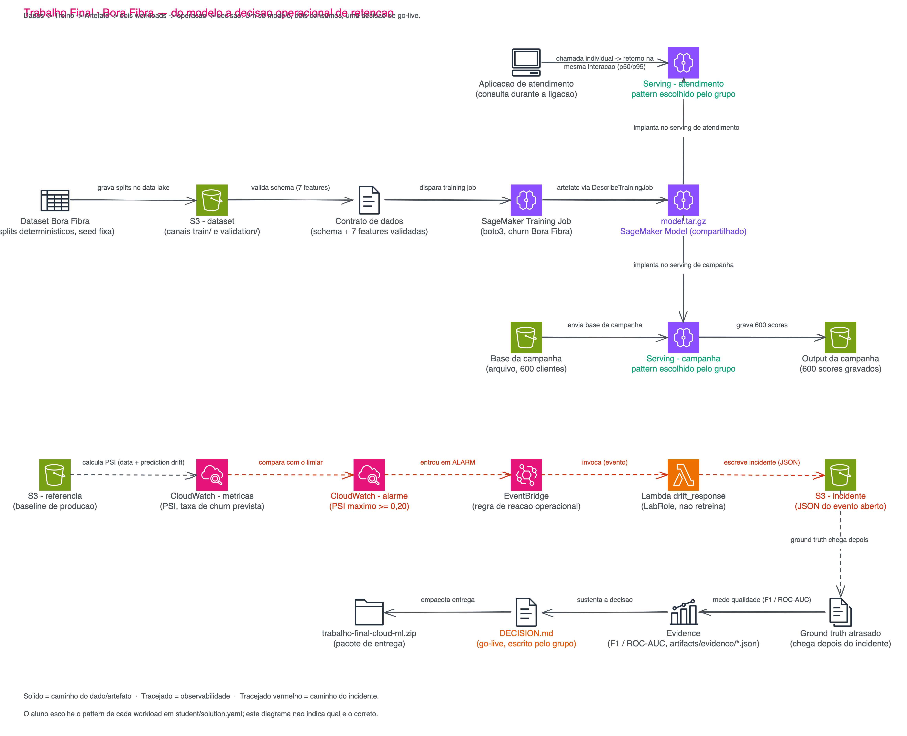
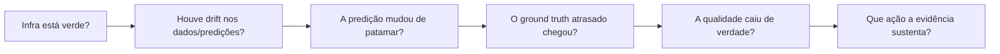

# 05 - Trabalho Final: Bora Fibra — do modelo à decisão operacional

> Antes de começar, confirme o ambiente em [01-create-codespaces/README.md](../01-create-codespaces/README.md) e o ritual de [início de aula](../01-create-codespaces/Inicio-de-aula.md). Todos os comandos abaixo rodam dentro do Codespaces da disciplina, a partir de `/workspaces/FIAP-Cloud-Based-Machine-Learning/05-Trabalho-Final`.

> [!IMPORTANT]
> Este é o **trabalho final avaliativo** da disciplina Cloud-Based Machine Learning. A composição do grupo (individual ou em grupo) é a definida pelo professor em aula — se for em grupo, combinem antes quem executa os comandos e em qual conta do AWS Academy, porque toda a evidência precisa vir de uma única execução coerente. A sessão do AWS Academy Learner Lab continua valendo as mesmas 4 horas por vez dos laboratórios anteriores.

> [!WARNING]
> **Você não precisa escrever código neste trabalho.** Toda a infraestrutura, automação, Terraform, Python e integração com a AWS já estão fornecidos e já foram provisionados por você em `make deploy`. A sua responsabilidade é escolher duas opções de arquitetura, executar o cenário, interpretar a evidência que ele produz e defender a decisão.
>
> Você edita exatamente dois arquivos:
>
> ```text
> student/solution.yaml
> student/DECISION.md
> ```
>
> Nenhum passo deste README pede para você abrir um `.tf`, `.py`, `.sh`, o `Makefile` ou uma Lambda. Se em algum momento você achar que precisa editar algo além desses dois arquivos para concluir, **pare** — o trabalho não pede isso, e você provavelmente pulou um comando.

> [!WARNING]
> **Pré-requisitos:**
>
> - [ ] Codespaces da disciplina aberto e credenciais do AWS Academy renovadas (`aws sts get-caller-identity` responde sem erro).
> - [ ] Labs [02](../02-ml-system/README.md), [03](../03-serving-and-scaling/README.md) e [04.1](../04-ml-operations/01-observability-drift-response/README.md) concluídos — pré-requisito conceitual, não técnico: este trabalho não depende de nenhum arquivo runtime deles, mas assume que você já viu o que cada comando faz.
> - [ ] Nenhuma ferramenta nova para instalar. O Codespaces já vem com Python 3.12, AWS CLI e Terraform 1.15.8.
>
> **Tempo estimado: ~90 minutos. Reserve até 2 horas se precisar revisar conceitos ou depurar credenciais.**

| Bloco | O que acontece | Tempo alvo |
|---|---|---:|
| `make bootstrap` | Ambiente, dataset, contrato de dados, Terraform validado | 5–8 min |
| `make deploy` | Treino e todos os candidatos de serving + observabilidade, em dois estágios | 15–20 min |
| `make compare` + escolher | Ler `candidates.md` e editar as duas linhas de `student/solution.yaml` | 10–12 min |
| `make run` | Atendimento, campanha, drift, incidente, ground truth, evidência | 12–18 min |
| Escrever `DECISION.md` | Interpretar `evidence.md` e preencher as 10 seções | 20–25 min |
| `make finish` | Destruir, provar limpeza, empacotar e validar o zip | 8–10 min |

## Contexto

> **Sexta-feira, 16h40.** Você é a pessoa de dados da **Bora Fibra**. Na segunda-feira de manhã a operação de retenção entra no ar com um piloto: os primeiros clientes de risco vão ser abordados de dois jeitos diferentes, ao mesmo tempo. **Helena Marques, diretora de receita**, aparece na sua mesa antes de sair — ela já foi a pessoa que pediu o modelo no Lab 02, e agora precisa fechar como ele entra em produção de verdade:
>
> > *"Fechei a operação para segunda. Atendimento precisa consultar o risco de cancelamento **durante a ligação** — o cliente está na linha, não dá para fazer ele esperar. Marketing precisa da lista priorizada da campanha piloto **pronta antes do expediente**, para os seiscentos clientes da base que vamos abordar essa semana — isso não tem gente esperando resposta, é processado de uma vez. E tem outra coisa: tivemos **reajuste de preço e mudança de política comercial** essa semana. Antes de eu autorizar o go-live, preciso saber se o modelo que vocês treinaram no Lab 02 ainda está confiável, ou se o mundo já mudou debaixo dele."*
>
> Você tem até segunda para fechar duas coisas: **qual arquitetura serve cada workload**, e **se a evidência atual sustenta autorizar o go-live**. Ninguém vai escrever uma linha de infraestrutura nova para isso — o que falta é decidir, com o que você já viu nos laboratórios anteriores.

### Pergunta-âncora

> **Qual arquitetura atende os dois workloads e a evidência atual permite o go-live do modelo?**

Você vai responder essa pergunta uma vez em cada metade do trabalho: a primeira metade decide *como servir*; a segunda decide *se o que está servindo pode ir para produção*.

### Os dois workloads, em termos de requisito

Nenhuma das linhas abaixo nomeia uma tecnologia. São os fatos que a Helena te deu — a arquitetura que atende cada um, você decide lendo os labs que já fez.

| Critério | Workload A — Atendimento | Workload B — Campanha piloto |
|---|---|---|
| **Quem espera a resposta** | Uma pessoa, ao telefone, agora | Ninguém: o resultado é consumido depois, como lista |
| **Sincronia** | Precisa da resposta **dentro da mesma interação** | Não há interação — é processamento em lote |
| **Volume por execução** | 1 cliente por vez | 600 clientes de uma vez, numa única rodada |
| **Frequência** | Recorrente, imprevisível, o dia inteiro | 1 execução por dia, num horário planejado |
| **Tolerância à primeira resposta lenta** | Baixa — ninguém aceita silêncio ao telefone | Alta — ninguém está olhando o relógio |
| **Custo de capacidade ociosa 24/7 só para isto** | Aceitável — é o preço de estar sempre disponível | Desperdício — a capacidade fica parada 23h59 por dia |

## O problema

Traduzindo a fala da Helena: você precisa de uma arquitetura de serving para "atendimento" e outra para "campanha", e precisa de evidência — não de opinião — sobre se o modelo `churn-v1`, treinado no Lab 02, ainda está confiável depois do reajuste de preço e da mudança de política comercial desta semana. As duas respostas vêm do mesmo cenário, executado uma vez.

## Arquitetura

`make deploy` já sobe **todos** os candidatos de uma vez: um único `model.tar.gz` treinado agora, servido simultaneamente por Real-Time Endpoint, Serverless Endpoint e Async Endpoint, mais suporte a Batch Transform sob demanda, com autoscaling, dashboard, alarmes, EventBridge e Lambda de reação já configurados. Nada disso depende da sua escolha em `student/solution.yaml` — a escolha decide **qual caminho você usa**, não qual caminho existe.



O apply acontece em dois estágios, na ordem que `make deploy` já encadeia: o primeiro sobe storage e dispara o training job (`enable_serving=false`); depois que o artefato é confirmado via `DescribeTrainingJob` + `HeadObject` — nunca montado por convenção —, o segundo estágio sobe o Model e os três endpoints (`enable_serving=true`). Você não decide isso nem precisa acompanhar o Terraform: o `Makefile` já faz a virada de estágio por você.

<details>
<summary>💡 Clique para entender: por que os três endpoints coexistem</summary>

O dashboard e os alarmes deste trabalho observam as métricas por `Window` (janela `baseline`/`shifted`), nunca por `EndpointName`. Isso é deliberado: como os três endpoints ficam de pé ao mesmo tempo e qual deles está "em produção" é escolha sua, nenhum arquivo do repositório — Terraform, Python ou este README — pode assumir qual dos três você marcou.

</details>

## O quebra-cabeça

Depois de `make deploy`, a única decisão de arquitetura do trabalho mora em duas linhas:

```yaml
serving:
  atendimento:
    pattern: TODO   # realtime | serverless
  campanha:
    pattern: TODO   # async | batch
```

As opções aceitas para cada workload já vêm restritas ao par que faz sentido para aquele tipo de requisito — isso reduz ruído, sem entregar a decisão em si. Não existe um campo `on_drift_alarm` nem nada parecido: a decisão sobre o que fazer com o drift observado não é uma opção de configuração, é o que você vai escrever em `student/DECISION.md`, depois de ver a evidência.

## Mapa do trabalho

| Fase | O que você faz | Tempo alvo |
|---|---|---:|
| 🧰 **A — Preparar** | Sobe o ambiente e todos os candidatos de serving; gera a evidência comparativa. Nenhuma decisão sua ainda. | ~25–30 min |
| 🛠️ **B — Resolver** *(é aqui que o trabalho realmente acontece)* | Lê o comparativo, escolhe os dois patterns, roda o cenário completo, interpreta a evidência e escreve o `DECISION.md`. | ~45–55 min |
| 📦 **C — Entregar** | Destrói a infraestrutura, prova a limpeza por API, empacota e valida o zip para o portal FIAP. | ~8–10 min |

## Execução

### 🧰 Fase A — Preparar

**1.** Rode o bootstrap.

```bash
make bootstrap
```

> `[doctor]` reportando `[PASS]` em credencial, região e ferramentas; dataset gerado em `artifacts/data/`; contrato de dados aprovado; Terraform validado. Termina com `== bootstrap concluído ==`.

**2.** Suba o treino e todos os candidatos de serving.

```bash
make deploy
```

> Duas seções de log: `== estágio 1/2: storage, dataset e training job (enable_serving=false) ==`, depois a espera pelo training job (`training-status --wait`) e a confirmação do artefato, e por fim `== estágio 2/2: model, os três candidatos de serving e a observabilidade ==`. Termina imprimindo os outputs do Terraform (`realtime_endpoint_name`, `serverless_endpoint_name`, `async_endpoint_name`, `dashboard_name`, entre outros) e `== deploy concluído ==`.

<details>
<summary>⚠ Se der erro: <code>ExpiredToken</code> ou <code>Unable to locate credentials</code></summary>

A sessão do AWS Academy Learner Lab dura 4 horas. Abra `AWS Details → AWS CLI` de novo, copie as credenciais para `~/.aws/credentials` e rode `aws sts get-caller-identity` antes de repetir o comando. `make deploy` é seguro de repetir: o Terraform só cria o que ainda não existe.

</details>

**3.** Gere o comparativo entre os quatro candidatos, sem alterar nada na infraestrutura.

```bash
make compare
```

> `artifacts/evidence/candidates.md` com duas tabelas: **"Atendimento: realtime x serverless"** (amostra, primeira chamada em ms, p50/p95 aquecido, instâncias correntes, modelo de capacidade) e **"Campanha: async x batch"** (linhas de entrada/saída, tempo observado, protocolo de consumo, infraestrutura). O documento não recomenda nem ordena nada — a leitura é sua.

```text
| Candidato  | Amostra | p50 (ms) | p95 (ms) |
|------------|---------|----------|----------|
| realtime   | ...     | <medido na sua execução> | <medido na sua execução> |
| serverless | ...     | <medido na sua execução> | <medido na sua execução> |
```

> Formato ilustrativo de um recorte de `candidates.md` — os números reais vêm da sua execução; a ordem das linhas não indica preferência.

### 🛠️ Fase B — Resolver

**4.** Abra `artifacts/evidence/candidates.md` e leia as duas tabelas até conseguir responder, por escrito, por que cada workload pede o que pede — compare linha a linha com a tabela de requisitos da seção [Contexto](#contexto).

**5.** Edite as duas linhas de `student/solution.yaml` com a sua escolha (bloco YAML da seção [O quebra-cabeça](#o-quebra-cabeça)).

**6.** Rode o cenário completo com o que você escolheu.

```bash
make run
```

> Uma sequência de blocos: validação do YAML, atendimento (40 clientes, um por vez), campanha (600 clientes em lote), publicação da janela `baseline`, publicação da janela `shifted` (drift), estado dos alarmes, confirmação do incidente aberto pela Lambda, avaliação de qualidade com o ground truth atrasado, e por fim `artifacts/evidence/evidence.md` fechado com a cadeia inteira registrada.

> 📸 **Print obrigatório:** abra o link de `dashboard_url` (impresso por `make deploy` ou por `make dashboard`) e capture a tela do CloudWatch depois que `make run` publicar as duas janelas. É a única evidência visual exigida neste trabalho — o resto da prova é o dossiê estruturado em `artifacts/evidence/`, não uma captura de tela. Guarde o print junto com a sua entrega; ele não entra automaticamente no zip.

<details>
<summary>⚠ Se der erro: <code>TODO</code> não substituído ou valor inválido no YAML</summary>

`make run` valida `student/solution.yaml` antes de fazer qualquer chamada e recusa continuar se `pattern` ainda for `TODO` ou não estiver entre os dois valores aceitos daquele workload (`realtime|serverless` para atendimento, `async|batch` para campanha). A mensagem de erro repete os valores aceitos — ela não sugere qual marcar.

</details>

**7.** Interprete `artifacts/evidence/evidence.md` — veja a seção [Interpretando a evidência](#interpretando-a-evidência) abaixo para saber como ler, não o que concluir.

**8.** Preencha as 10 seções de `student/DECISION.md` — veja [O DECISION.md](#o-decisionmd).

Se você voltar depois e trocar `student/solution.yaml`, repita só os passos 5 a 8: `make run` nunca reprovisiona nem retreina, então uma segunda passada custa minutos, não meia hora de novo.

### 📦 Fase C — Entregar

**9.** Rode o encerramento.

```bash
make finish
```

> Encadeia `check` (confere que `DECISION.md` não tem mais `<preencher>` e que a evidência mínima existe), `destroy`, `verify-clean`, gera `evidence.md` final, empacota e valida o zip. Termina nos 7 `[PASS]` do `validate-package` — ver a seção [Entrega](#entrega).

## Interpretando a evidência

`evidence.md` conta uma história em seis atos. Leia na ordem — cada ato só faz sentido se o anterior já tiver uma resposta:



Nenhuma resposta de uma pergunta decide a próxima sozinha: drift não é sinônimo de qualidade ruim, e infraestrutura saudável não é sinônimo de modelo confiável. São medidas diferentes, e `DECISION.md` pede que você as trate como diferentes. Execução sem decisão não conclui o trabalho; decisão sem evidência também não conclui o trabalho.

| Métrica que você olha | Pergunta que ela responde | Decisão que ela informa | Impacto para a Helena |
|---|---|---|---|
| Estado do endpoint / alarme `OK` vs. `ALARM` | A infraestrutura está de pé e respondendo? | Se não, nada abaixo importa ainda — resolva isto primeiro | Atendimento não pode consultar risco de cancelamento se o endpoint não responde |
| `DataDriftPSIMax` / `PredictionDriftPSI` | Os dados ou as predições mudaram de distribuição desde o reajuste de preço? | Isto sozinho não diz se o modelo piorou | Se ninguém olha, a operação decide com dados que já não representam o cliente atual |
| `PredictedChurnRate` antes/depois | O modelo está prevendo cancelamento em proporção diferente? | Ajuda a calibrar a expectativa da campanha (lista maior ou menor que o normal) | Lista de campanha maior/menor que o esperado sem explicação vira dúvida sobre o modelo |
| `ModelQualityF1` / `ModelQualityROCAUC` (com ground truth atrasado) | O modelo continua acertando quem cancela e quem não cancela? | Esta é a métrica que de fato sustenta ou não o go-live | Falso negativo aqui é cliente que cancela sem ninguém tentar reter; falso positivo é abordagem desnecessária |

```text
| Métrica             | Baseline | Shifted                  | Limiar |
|---------------------|----------|---------------------------|--------|
| DataDriftPSIMax     | ...      | <medido na sua execução> | 0.20   |
| PredictionDriftPSI  | ...      | <medido na sua execução> | 0.20   |
```

> Formato ilustrativo de um recorte de `evidence.md` — os valores reais saem da sua execução, não deste README.

Cada afirmação de `evidence.md` cita o arquivo e o campo de `artifacts/evidence/` que a sustenta — nenhuma linha ali recomenda ou conclui qual pattern de serving foi "melhor". Essa leitura é sua, registrada em `DECISION.md`.

## O DECISION.md

`student/DECISION.md` é um documento de decisão, não uma opinião solta: 10 seções, cada uma com uma pergunta-guia que cita um campo específico de `artifacts/evidence/` (por exemplo, `production-drift.json` para a evidência de drift, `quality.json` para a queda de qualidade). O documento abre com as duas frases que resumem a regra do trabalho:

> [!IMPORTANT]
> **Execução sem decisão não conclui o trabalho.**

> [!IMPORTANT]
> **Decisão sem evidência não conclui o trabalho.**

Duas das dez seções pedem explicitamente uma **condição executável**, não uma opinião: a condição de retraining e a condição de rollback. "Se o F1 medido em `quality.json` cair abaixo de 0,70 em duas entregas seguidas" é uma condição — dá para checar automaticamente. "Quando parecer que o modelo piorou" não é. O mesmo padrão que o Lab 04.1 já pediu no `DECISION.md` daquele laboratório.

## Como será avaliado

Este trabalho é avaliado como **resolução de problema**, não como soma de tarefas cumpridas e não como qualidade de programação. Você não escreve Terraform nem Python aqui — então não existe avaliação de código autoral. O que é avaliado é o raciocínio que conecta a escolha de arquitetura, a evidência que você gerou e a decisão que você defendeu.

**O problema foi resolvido de verdade?** As duas escolhas do `solution.yaml` precisam fazer sentido para os requisitos de cada workload — sincronia, volume, frequência, tolerância a espera, custo de capacidade ociosa. Não existe uma única combinação "correta" cravada em pedra; existe uma combinação que sua evidência sustenta.

**Funcionou de verdade?** A automação fornecida precisa ter sido executada de ponta a ponta, não simulada. O pacote de evidência precisa mostrar treino, artifact, serving, atendimento, campanha, monitoramento, drift, incidente, qualidade e cleanup — cada elo da cadeia, provado, não descrito de memória.

**A evidência sustenta a decisão?** O `DECISION.md` precisa citar número real, não opinião solta. Ele distingue problema de infraestrutura, drift e queda de qualidade — os três não são a mesma coisa e não têm a mesma resposta. Ele traduz falso positivo e falso negativo para o que isso custa para a Bora Fibra, não só para uma métrica. Ele diz **o que não automatizar**, define uma condição executável de retraining e uma condição executável de rollback.

**A história é coerente?** `student/solution.yaml`, a evidência em `artifacts/evidence/` e `student/DECISION.md` precisam contar a mesma história. Se a decisão diz uma coisa e a evidência mostra outra, isso é o problema — não um detalhe.

**O processo fornecido foi respeitado?** Contrato de dados antes de gastar computação, artifact lido da API (nunca montado por convenção), evidência estruturada em vez de alegação, nenhum segredo commitado, cleanup provado, pacote válido. Isto não é avaliação de habilidade de escrever infraestrutura como código — é disciplina de engenharia com o que foi fornecido.

**Alguém de fora entende?** A entrega precisa ser compreensível pela Helena lendo o resumo executivo do `DECISION.md`, e pelo professor lendo a evidência e a decisão em poucos minutos — sem precisar reconstruir o seu raciocínio a partir de fragmentos.

### O que invalida o trabalho

Independente de qualquer outro ponto acima, o trabalho não se sustenta se acontecer qualquer uma destas situações: a automação não foi de fato executada; a evidência foi inventada ou editada à mão; ficou credencial dentro do ZIP; algum recurso faturável foi deixado ligado; a decisão registrada contradiz a evidência que o próprio grupo gerou; `DECISION.md` está ausente ou incompleto nos placeholders obrigatórios; os outputs de Terraform não estão presentes; o ZIP não passa em `validate-package`. Cada um desses pontos é uma falha grave por si só — não um detalhe a descontar.

## Entrega

A única forma de submissão válida é o zip gerado por `make finish` (destrói, prova a limpeza, empacota e valida), enviado no portal FIAP — e-mail, Slack ou link de repositório não substituem esse upload.

```bash
make finish
```

Isso produz `trabalho-final-cloud-ml.zip`, com código, configuração e o dossiê completo de `artifacts/evidence/` (incluindo `manifest.json` com o hash de cada arquivo e `SUBMISSION.md`, gerado automaticamente com a conta mascarada, o commit e os patterns escolhidos). `validate-package` confere o zip por fora, exatamente como o portal vai receber, e imprime sete vereditos em sequência:

```text
[PASS] estrutura
[PASS] solução
[PASS] decisão
[PASS] evidência
[PASS] segurança
[PASS] cleanup
[PASS] pacote pronto para o portal FIAP
```

Qualquer `[FAIL]` nessa lista aponta exatamente qual pré-condição falhou — releia a mensagem antes de tentar de novo.

## Cleanup

`make finish` já chama `destroy` e `verify-clean` internamente — não é um passo extra que dá para esquecer. `verify-clean` nunca lê o state do Terraform para decidir se algo ainda existe: ele consulta a API da AWS, recurso por recurso (endpoints, endpoint configs, models, scalable targets, scaling policies, alarmes, regra do EventBridge, Lambda, dashboard, bucket e jobs de treino/transform em andamento), e só reporta `passed: true` se todos os doze responderem vazio.

```text
[PASS] cleanup — 12/12 verificações, 0 falhas
```

> [!CAUTION]
> Não feche o Codespaces nem interrompa o terminal enquanto `make finish` estiver correndo. Um `destroy` interrompido no meio pode deixar um endpoint faturando sem que o `verify-clean` seguinte o veja — porque ele checou antes do `destroy` terminar, não depois.

## De onde vem cada peça

Nada neste trabalho é assunto novo. Cada linha da tabela abaixo já foi executada por você em algum laboratório anterior — o que muda aqui é que você **escolhe** entre alternativas plausíveis e **defende** a escolha com evidência, em vez de seguir um passo a passo que já diz o que fazer. Revisar o conceito no laboratório de origem é permitido e esperado; nenhum laboratório vai te dizer qual `pattern` marcar no `solution.yaml` — isso é a parte que é sua.

| Parte do Trabalho Final | Onde você já fez isso | O que revisar exatamente |
|---|---|---|
| Contrato de dados antes de gastar computação | [Lab 02, Parte 2 — Dados e contrato](../02-ml-system/README.md#parte-2---dados-e-contrato) | `make data` + o contrato executável (48 verificações) que reprova antes de qualquer treino custar dinheiro |
| Treino no SageMaker e artifact lido da API, nunca por convenção | [Lab 02, Parte 3 — Provisionamento, treino e serving](../02-ml-system/README.md#parte-3---provisionamento-treino-e-serving) | `make apply` em dois estágios; por que `model_artifact_s3_uri` vem de `DescribeTrainingJob`, não de um caminho montado à mão |
| Model → EndpointConfig → Endpoint | [Lab 02, Parte 3 — Provisionamento, treino e serving](../02-ml-system/README.md#parte-3---provisionamento-treino-e-serving) | O segundo estágio do `make apply`: como o artifact do primeiro estágio alimenta o `aws_sagemaker_model` e o endpoint |
| Avaliação do modelo e matriz de confusão | [Lab 02, Parte 4 — Chamando o modelo e medindo o que ele vale](../02-ml-system/README.md#parte-4---chamando-o-modelo-e-medindo-o-que-ele-vale) e [Lab 04.1, Parte 6 — A verdade chega atrasada](../04-ml-operations/01-observability-drift-response/README.md#parte-6---a-verdade-chega-atrasada) | `make evaluate` (baseline majoritário, ROC-AUC, PR-AUC) no Lab 02; `make ground-truth` (F1, ROC-AUC, matriz sobre produção) no Lab 04.1 |
| Escolher entre Real-Time e Serverless | [Lab 03, Parte 4 — Síncrono persistente vs serverless](../03-serving-and-scaling/README.md#parte-4---síncrono-persistente-vs-serverless) | `make compare`: mesma lista de registros nos dois endpoints, latência medida lado a lado |
| Escolher entre Async e Batch Transform | [Lab 03, Parte 5 — Quando esperar é parte do contrato](../03-serving-and-scaling/README.md#parte-5---quando-esperar-é-parte-do-contrato) | `make async` e `make batch`: protocolo de consumo, persistência de infraestrutura, necessidade de polling/arquivo |
| Ler first request, p50, p95, throughput | [Lab 03, Parte 4](../03-serving-and-scaling/README.md#parte-4---síncrono-persistente-vs-serverless) e [Parte 6 — Concorrência e elasticidade](../03-serving-and-scaling/README.md#parte-6---concorrência-e-elasticidade) | `make compare` (latência) e `make load` (p50/p95/RPS sob concorrência) |
| Capacidade ociosa e autoscaling | [Lab 03, Parte 6 — Concorrência e elasticidade](../03-serving-and-scaling/README.md#parte-6---concorrência-e-elasticidade) | A demonstração de elasticidade 1→2→1 provada por API, e o que ela custa parada |
| Decidir por contrato de workload e defender a escolha | [Lab 03, Parte 7 — Dossiê e decisão](../03-serving-and-scaling/README.md#parte-7---dossiê-e-decisão) | Como o `DECISION.md` daquele lab amarra latência/throughput medidos à escolha de padrão de serving |
| Baseline, PSI e drift de predição | [Lab 04.1, Parte 3 — O dashboard e a linha de base](../04-ml-operations/01-observability-drift-response/README.md#parte-3---o-dashboard-e-a-linha-de-base) e [Parte 4 — O mundo muda](../04-ml-operations/01-observability-drift-response/README.md#parte-4---o-mundo-muda) | `make baseline` (PSI de referência) e `make drift` (PSI da janela deslocada, limiar didático 0.20) |
| CloudWatch, alarme e dashboard | [Lab 04.1, Parte 3 — O dashboard e a linha de base](../04-ml-operations/01-observability-drift-response/README.md#parte-3---o-dashboard-e-a-linha-de-base) | `make dashboard` e `make status`: como o alarme observa `DataDriftPSIMax`/`PredictionDriftPSI` |
| EventBridge + Lambda abrindo incidente | [Lab 04.1, Parte 5 — De observação a incidente](../04-ml-operations/01-observability-drift-response/README.md#parte-5---de-observação-a-incidente) | `make alarm-status`: o alarme dispara o EventBridge, que invoca a Lambda que grava o incidente — e não retreina nada |
| Ground truth atrasado, F1 e ROC-AUC | [Lab 04.1, Parte 6 — A verdade chega atrasada](../04-ml-operations/01-observability-drift-response/README.md#parte-6---a-verdade-chega-atrasada) | `make ground-truth`: por que a qualidade só é medida quando o rótulo verdadeiro chega, sempre depois da predição |
| Condição de retraining e de rollback | [Lab 04.1, Parte 6 — A verdade chega atrasada](../04-ml-operations/01-observability-drift-response/README.md#parte-6---a-verdade-chega-atrasada) (seção do `DECISION.md` daquele lab) | A diferença entre "condição executável" e "opinião" nas duas perguntas do `DECISION.md` |
| Cleanup provado por API | Todos os labs: [Lab 02, Parte 6](../02-ml-system/README.md#parte-6---encerramento-e-limpeza) · [Lab 03, Parte 8](../03-serving-and-scaling/README.md#parte-8---encerramento-obrigatório) · [Lab 04.1, Parte 7 — Destruir e provar](../04-ml-operations/01-observability-drift-response/README.md#parte-7---destruir-e-provar) · [Lab 04.2](../04-ml-operations/02-slm-sagemaker/README.md) | `make destroy` + `make verify-clean` (aqui encadeados dentro de `make finish`): nunca confiar no state, sempre provar por varredura de API |
| CI/CD e promoção segura de modelo | [Lab 04.2](../04-ml-operations/02-slm-sagemaker/README.md) | `make compare` (V1 vs. V2) e o fluxo de runner efêmero — o mesmo raciocínio de "comparar antes de promover" que este trabalho pede na Fase B |

## Conclusão

Você entregou uma arquitetura de serving escolhida para dois workloads com requisitos opostos, executou o cenário completo sem reprovisionar nada por engano, leu a evidência estruturada que ela produziu e registrou uma decisão de go-live defensável em `DECISION.md` — com condição de retraining e de rollback executáveis, não opiniões. É a mesma pergunta que a Helena fez em cada laboratório anterior, respondida agora de ponta a ponta, numa única execução.

## Próximo passo

Não há próximo laboratório na disciplina — este é o encerramento do percurso Bora Fibra. Se quiser aprofundar algum ponto específico da decisão, volte ao laboratório de origem listado em [De onde vem cada peça](#de-onde-vem-cada-peça).

<details>
<summary>💡 Glossário rápido</summary>

| Termo | O que é |
|---|---|
| `solution.yaml` | Único arquivo onde você escolhe os dois patterns de serving |
| `DECISION.md` | Documento de decisão de go-live, com 10 seções guiadas por evidência |
| `candidates.md` / `evidence.md` | Dossiês gerados em `artifacts/evidence/`: o primeiro compara, o segundo conclui a execução |
| Real-Time Endpoint | Instância dedicada, sempre ligada, latência previsível |
| Serverless Endpoint | Capacidade gerenciada pela AWS, sem instância dedicada visível |
| Async Endpoint | Requisição e resposta desacopladas pelo S3, consumidas por polling |
| Batch Transform | Job efêmero: a instância existe só durante o processamento e some depois |
| PSI (Population Stability Index) | Métrica de quanto uma distribuição se deslocou em relação a uma referência |
| Drift de dados vs. drift de predição | O primeiro mede as features de entrada; o segundo mede a saída do modelo |
| `PredictedChurnRate` | Proporção de clientes que o modelo classifica como propensos a cancelar, numa janela |
| Baseline majoritário | Referência mínima de qualidade: sempre prever a classe mais comum |
| F1 / ROC-AUC | Métricas de qualidade calculadas sobre o ground truth, quando ele chega |
| Ground truth atrasado | O rótulo verdadeiro só existe depois da predição — a qualidade real só se mede então |
| EventBridge | Serviço que observa a mudança de estado do alarme e aciona a Lambda de reação |
| `LabRole` | Role de IAM já provisionada pelo AWS Academy; o trabalho não cria roles novas |
| Estágio 1 / estágio 2 (`enable_serving`) | Portão do apply: primeiro só storage e treino, depois model + serving + observabilidade |
| `make finish` | Comando único que destrói, prova a limpeza, empacota e valida a entrega |
| `verify-clean` | Prova de que nada ficou faturando, feita por consulta direta à API, nunca pelo state |

</details>

<details>
<summary>💡 Como pedir ajuda se travou</summary>

| Sintoma | O que fazer |
|---|---|
| `ExpiredToken` / `Unable to locate credentials` | Renove a credencial do AWS Academy (`AWS Details → AWS CLI`) e confirme com `aws sts get-caller-identity` antes de repetir o comando |
| Endpoint em estado `Failed` | Rode `make status` para ver os outputs do Terraform e `make doctor` para o diagnóstico automatizado — releia a mensagem de erro exibida |
| YAML inválido / `TODO` não substituído | `make run` mostra de novo os valores aceitos (`realtime\|serverless`, `async\|batch`) na mensagem de erro |
| "Qual pattern eu escolho?" | Releia os requisitos dos dois workloads em [Contexto](#contexto), releia `artifacts/evidence/candidates.md` gerado por `make compare`, e revise o Lab 03 — nenhuma dessas fontes responde por você, mas as três juntas bastam |
| `make finish` falha em `validate-package` | O `[FAIL]` indica a pré-condição específica: YAML sem `TODO`, `DECISION.md` sem `<preencher>`, evidência completa ou `verify-clean` com `PASS` |

Se travar em algo que essa tabela não cobre, procure o professor ou monitores durante a aula, informando **o comando exato** e **o erro literal** copiado do terminal.

</details>
