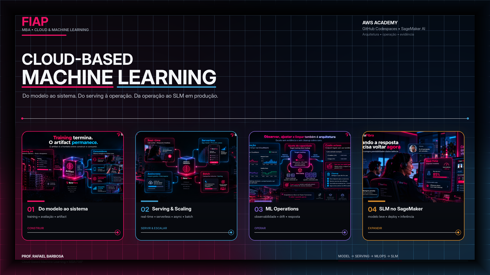

<p align="center">
  
</p>

# Cloud-Based Machine Learning

Repositório oficial dos laboratórios práticos da disciplina **Cloud-Based Machine Learning** do MBA da FIAP. Aqui você encontrará todos os exercícios guiados, scripts de apoio e instruções para evoluir de um modelo treinado até uma capacidade de predição servida, escalada e operada na nuvem AWS.

---

## Visão geral

Os laboratórios foram desenhados para serem executados em um ambiente padronizado (GitHub Codespaces + AWS Academy), garantindo que todos os alunos tenham a mesma experiência, sem precisar instalar nada localmente.

Você irá percorrer um caminho que evolui de um modelo isolado até um sistema de ML operado em produção, sempre sobre a mesma capacidade de negócio — a previsão de churn da empresa fictícia **Bora Fibra**:

1. **Preparação do ambiente** — fork do repositório, Codespaces da disciplina, AWS Academy, bucket base no S3 e credenciais.
2. **Do modelo ao sistema** — contrato de dados executável, training job, artefato lido pela API e endpoint real-time servindo um XGBoost treinado na sua conta.
3. **Serving e escala** — o mesmo `model.tar.gz` sustentando quatro contratos de consumo (real-time, serverless, async e batch transform), com autoscaling real e elasticidade provada por API.
4. **Operação e observabilidade** — drift de dados e de predições com PSI, métricas customizadas no CloudWatch, dashboard, alarme que vira incidente via EventBridge e Lambda, e a queda de qualidade medida quando o ground truth chega.
5. **Trabalho Final** — projeto end-to-end consolidando o ciclo de vida completo.

Um fio conduz a disciplina inteira: **infraestrutura verde não é o mesmo que sistema correto.** Cada laboratório termina com um dossiê de evidência conferível e com a conta limpa, comprovada por varredura de API.

---

## Pré-requisitos

Antes de iniciar qualquer laboratório, você precisa de:

- uma conta no [GitHub](https://github.com) (para fork do repositório e Codespaces)
- uma conta ativa no [AWS Academy](https://www.awsacademy.com/LMS_Login) com a turma `AWS Academy Learner Lab`
- acesso ao email institucional da FIAP (`rm<SEU_RM>@fiap.com.br`)

> [!IMPORTANT]
> **SEMPRE DESLIGUE** o Codespaces ao final da aula para não consumir créditos desnecessariamente. Acesse [github.com/codespaces](https://github.com/codespaces), clique nos três pontinhos ao lado do ambiente e selecione `Stop Codespace`.

> [!WARNING]
> **O endpoint do SageMaker cobra por hora enquanto existir**, mesmo ocioso e mesmo com o Codespaces desligado. Desligar o Codespaces **não** destrói a infraestrutura da AWS. Ao final de cada laboratório, rode `make destroy` seguido de `make verify-clean` dentro da pasta do lab.

---

## Como usar este repositório

### 1. Faça o fork

Clique em `Fork` no canto superior direito da página do repositório no GitHub e copie-o para sua conta. Mantenha a opção `Copy the master branch only` **desmarcada** para ter acesso a todas as branches.

### 2. Crie o Codespaces

A partir do seu fork, crie um Codespace usando a configuração `FIAP Lab` na região `US East` com máquina `2-core`. O ambiente já vem com todas as dependências necessárias: Python 3.12, AWS CLI, Terraform **1.15.8** (versão exata, porque os labs fixam `required_version`) e região padrão `us-east-1`.

**Você cria este Codespaces uma única vez, na primeira aula, e reabre o mesmo em todas as outras.** Não existe um ambiente por laboratório: o que cada lab precisa de específico é instalado por dentro, com `bash scripts/setup.sh` (ou `make setup`).

### 3. Configure as credenciais AWS

A cada sessão do AWS Academy, copie as credenciais em `AWS Details → AWS CLI` para o arquivo `~/.aws/credentials` do Codespaces. Valide com:

```bash
aws sts get-caller-identity
```

### 4. Siga os laboratórios na ordem

Comece pelo setup e avance sequencialmente. Cada laboratório tem seu próprio `README.md` com instruções passo a passo numeradas, explicações contextuais (blocos `💡 Clique para entender`), tratamento de erro (blocos `⚠ Se der erro`) e prints de referência.

Dentro de cada lab, `make help` lista todos os alvos disponíveis e a ordem em que são usados.

> [!TIP]
> O passo a passo completo de configuração está em [01-create-codespaces/README.md](01-create-codespaces/README.md). Antes de **cada** aula, siga o ritual curto de [01.1 - Início de aula](01-create-codespaces/Inicio-de-aula.md): sincronizar o fork e renovar as credenciais, que expiram a cada 4 horas.

---

## Laboratórios disponíveis

| # | Laboratório | Descrição | Duração | Link |
|---|-------------|-----------|---------|------|
| 01 | **Setup e configuração do ambiente** | Fork do repositório, criação do Codespaces da disciplina, ativação da conta AWS Academy Learner Lab, criação do bucket base `base-config-<SEU_RM>` no S3 e configuração de credenciais. Setup único, feito uma vez. | ~30 min | [01-create-codespaces](01-create-codespaces/README.md) |
| 01.1 | **Ritual de início de aula** | Referência curta reaberta antes de cada aula: sincronizar o fork para puxar novos labs e renovar as credenciais do Academy. | 3–5 min | [Inicio-de-aula](01-create-codespaces/Inicio-de-aula.md) |
| 02 | **Do modelo ao sistema de Machine Learning** | Contrato de dados executável (incluindo quebrá-lo de propósito para ver o vazamento de rótulo), training job do XGBoost, artefato lido da API que o produziu e endpoint real-time servindo na sua conta. Avaliação contra 600 linhas que nunca entraram no treino: baseline majoritário, matriz de confusão, ROC-AUC, PR-AUC e calibração. | 75–90 min | [02-ml-system](02-ml-system/README.md) |
| 03 | **Serving and Scaling** | Um único `model.tar.gz` sustentando quatro contratos de consumo — Real-Time, Serverless e Async Endpoints mais um Batch Transform Job — com Application Auto Scaling configurado e uma demonstração determinística de elasticidade 1→2→1 provada por API. Latência (p50/p95/p99) versus throughput. | 75–95 min | [03-serving-and-scaling](03-serving-and-scaling/README.md) |
| 04.1 | **Observabilidade, drift e resposta operacional** | Prova na AWS real que um endpoint pode estar `InService`, responder HTTP 200 e ainda assim o modelo estar errado. Drift de dados e de predições com PSI, métricas customizadas no CloudWatch, dashboard em tempo quase real, alarme que vira incidente via EventBridge e Lambda, e a queda de F1/ROC-AUC medida quando o ground truth chega atrasado. Fecha com um `DECISION.md` escrito pelo aluno. | ~70 min | [04-ml-operations/01-observability-drift-response](04-ml-operations/01-observability-drift-response/README.md) |
| 04.2 | **Do score à ação: SLM, releases e CI/CD** | Deploy de um *small language model* (GGUF, quantizado, servido em CPU) no SageMaker para transformar o score de churn em uma ação de negócio redigida. Duas releases controladas do mesmo artefato — V1 manual e V2 publicada por um pipeline de CI/CD com runner self-hosted — sem nenhuma credencial AWS armazenada no GitHub, dashboard comparando as duas versões e `DECISION.md` sobre qual promover. | ~100 min | [04-ml-operations/02-slm-sagemaker](04-ml-operations/02-slm-sagemaker/README.md) |
| 05 | **Trabalho Final** | Projeto end-to-end consolidando ingestão, treino, serving e operação, com entregáveis prontos para upload no portal FIAP. | ~90 min | [05-Trabalho-Final](05-Trabalho-Final/README.md) |

---

## Estrutura do repositório

```
.
├── 01-create-codespaces/                    # Setup do ambiente (Codespaces, AWS Academy, credenciais)
│   ├── README.md                            #   Setup único, feito na primeira aula
│   └── Inicio-de-aula.md                    #   Ritual curto, reaberto antes de cada aula
├── 02-ml-system/                            # Lab 02 — do modelo ao sistema de ML
│   ├── config/                              #   Parâmetros do lab em YAML
│   ├── scripts/                             #   setup.sh + lab.py (superfície de comandos)
│   ├── src/                                 #   Código do lab, importável e testável
│   ├── terraform/                           #   Infraestrutura em dois estágios
│   ├── diagramas/                           #   Arquitetura (PNG + fonte Excalidraw)
│   └── Makefile                             #   `make help` lista o ciclo de vida
├── 03-serving-and-scaling/                  # Lab 03 — quatro contratos de consumo + autoscaling
├── 04-ml-operations/                        # Aula 3 — operação, confiabilidade e MLOps
│   ├── 01-observability-drift-response/     #   Lab 04.1 — PSI, CloudWatch, EventBridge, Lambda
│   └── 02-slm-sagemaker/                    #   Lab 04.2 — SLM, releases controladas e CI/CD
├── 05-Trabalho-Final/                       # Trabalho final — do modelo à decisão operacional
├── .devcontainer/                           # Configuração do GitHub Codespaces
└── fiap.png
```

Os labs 02, 03 e 04.1 seguem a mesma anatomia: `config/` com os parâmetros, `scripts/lab.py` como única superfície de comandos, `src/` com o código testável, `terraform/` com a infraestrutura e um `Makefile` que documenta o ciclo de vida completo. O Lab 04.1 acrescenta `tests/` com os testes unitários (PSI, contrato de dados, handler da Lambda). O Lab 04.2 segue a mesma base, com pastas extras próprias de um SLM (`model/`, `prompts/`, `eval/`) e do runner de CI/CD (`.github/workflows/`).

---

## Fluxo recomendado

```
01 Setup do ambiente
   │
   ▼
02 Do modelo ao sistema de ML
   │
   ▼
03 Serving and Scaling
   │
   ▼
04.1 Observabilidade, drift e resposta operacional
   │
   ▼
04.2 SLM, releases e CI/CD
   │
   ▼
05 Trabalho Final
```

Cada laboratório assume que os anteriores foram concluídos. Em especial:

- Todos os labs dependem do **Lab 01**: o mesmo Codespaces, a mesma conta AWS e o bucket `base-config-<SEU_RM>`.
- O **Lab 03** usa o Lab 02 como referência conceitual (o mesmo padrão de dois estágios, o mesmo jeito de ler o artefato pela API), mas **não depende de nenhum arquivo runtime dele**: gera o próprio treino do zero.
- O **Lab 04.1** continua a linhagem `churn-v1` do Lab 02 e assume os labs 02 e 03 concluídos, porque a história dele começa depois do go-live.
- O **Lab 04.2** assume os labs 02, 03 e 04.1 concluídos: reaproveita o endpoint de churn como origem do score que o SLM transforma em ação.

---

## Dicas gerais

- **`make help` primeiro.** Dentro de cada lab, ele lista todos os alvos e a ordem do ciclo de vida. Se você travou, `make doctor` diagnostica ferramentas, credencial, região e alcance dos serviços de uma vez.
- **Blocos `💡 Clique para entender`**: sempre que encontrar nos READMEs, abra — eles trazem o contexto técnico e a motivação pedagógica de cada comando. Os blocos `⚠ Se der erro` aparecem logo depois do passo que pode falhar.
- **Credenciais expiradas?** Cada sessão do AWS Academy dura 4 horas. Basta iniciar uma nova sessão e recopiar as credenciais para `~/.aws/credentials`. O sintoma típico é `ExpiredToken` no meio de um comando que funcionava.
- **Endpoint consumindo crédito?** É o risco real da disciplina, e ele não aparece na sua tela. Ao final de cada aula, rode `make destroy` e depois `make verify-clean` dentro da pasta do lab. O `verify-clean` consulta a API recurso por recurso, porque o state do Terraform não é autoridade suficiente para afirmar que a conta está limpa.
- **Terraform reclamando de versão?** Os labs fixam `required_version = "= 1.15.8"` de propósito: sem isso, uma turma com versões diferentes depura Terraform em vez de arquitetura de ML. No Codespaces da disciplina a versão já vem correta.
- **Painel e resumo prontos.** Nos labs 03, 04.1 e 04.2, `make dashboard` imprime o link do painel do CloudWatch já provisionado por Terraform, e `make resumo` preenche a tabela de evidências medidas dentro do `DECISION.md` — resta só escrever a decisão.

---

## Suporte

Caso encontre algum problema:

1. Releia atentamente o passo em que você está — os READMEs trazem os erros mais comuns sinalizados com `> [!IMPORTANT]`, `> [!WARNING]` ou nos blocos `⚠ Se der erro`.
2. Rode `make doctor` e leia a saída: ela responde credencial, região, role e versão de ferramenta de uma vez.
3. Valide os pré-requisitos listados no início de cada laboratório.
4. Consulte o professor ou monitores durante a aula, informando **em qual passo numerado** você travou e **o erro literal** copiado do terminal.

### Contato

Ficou com alguma dúvida ou quer trocar uma ideia sobre os laboratórios?

- 📧 **Email:** [Rafael@rfbarbosa.com](mailto:Rafael@rfbarbosa.com)
- 💼 **LinkedIn:** [Rafael Barbosa](https://www.linkedin.com/in/rafael-barbosa-serverless/)

---

**Bons estudos!** 🎓
